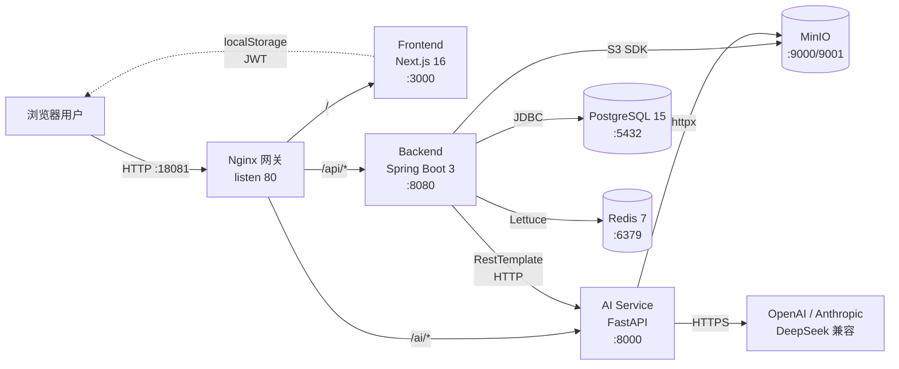

# 01 — 架构审查报告

**审查日期：** 2026-05-09
**项目 commit 基线：** `0f08c91 ds version`
**审查范围：** 全栈代码（backend / ai-service / frontend）+ 配置（docker-compose / nginx / application.yml / Flyway）+ 基础设施
**审查方法：** 静态代码 review + 配置 walk-through + 本地 docker compose 跑通验证（详见 `05-local-validation.md`）
**严重等级：** 🔴 阻塞 / 🟠 高 / 🟡 中 / 🟢 低

---

## 1. 当前架构总览

### 1.1 系统拓扑

### 1.2 技术栈摘要

| 层 | 技术 | 版本 | 关键依赖 |
|---|---|---|---|
| 前端 | Next.js + React + TypeScript | Next.js 16 / Node ≥20.9 | axios、zustand、React Flow、Tailwind |
| 后端 | Spring Boot + Spring Security + JPA | 3.x / Java 17 | Hibernate、Flyway、Lombok、SpringDoc、Lettuce |
| AI 服务 | FastAPI + uvicorn | Python 3.11 | openai、anthropic、PyMuPDF (fitz)、httpx |
| 数据 | PostgreSQL / Redis / MinIO | 15 / 7 / 2025-09 | — |
| 基础设施 | Docker Compose + Nginx | compose v2 / nginx alpine | 单文件编排 7 服务，宿主仅暴 18081 |

### 1.3 当前能力闭环

经过"ds version"基线一次合并，以下能力已**功能性落地**并能跑通：

- **认证授权**：注册 / 登录 / JWT 发放（access 1d + refresh 7d）
- **知识图谱**：4 学科、17 一级 Topic、74 个 408 知识点（Flyway V1+V2 种子）
- **SM-2 间隔重复**：评分 0-5 → 计算下次复习时间
- **Quiz 引擎**：题目生成（依赖 LLM）、答题、错题本
- **笔记 CRUD**：含权限校验
- **PDF 导入**：上传到 MinIO → AI 解析 → 提取知识点 → 选 Topic → 批量建节点
- **Stats**：DTO 化的总览（含 7 天趋势、薄弱点、连续天数）
- **Swagger**：`/api/swagger-ui` 已挂载
- **本地验证**：本审查实测 7 个容器全 Up，注册/登录/学科列表 API 全通（详见 `05-local-validation.md` §4）

但功能闭环 ≠ 可上线。下文将逐层、逐文件、按横切关注点剥开**当前最严重的 13 项🔴阻塞问题**与 47 项 🟠 高严重问题。

---

## 2. 逐层评估

### 2.1 前端（Next.js 16 / React / TypeScript）

**优点**
- 多阶段 Docker 构建 + Next.js standalone output，runner 镜像体积可控（`frontend/Dockerfile`）。
- API 客户端以 axios 拦截器统一处理 token 注入与 401，结构清晰（`frontend/src/lib/api.ts`）。
- 状态管理用 zustand 轻量、可读性好。
- 已有 Playwright smoke 测试覆盖注册→登录→dashboard 主路径（`frontend/tests/smoke.spec.ts`）。

**问题**
- 🔴 **token 存 localStorage**：`frontend/src/lib/auth.ts:9-15,22-28` 任何一次 XSS 即可窃走 access + refresh token，攻击者可在 token 生命周期（最多 7 天）内冒充用户。生产应改 HttpOnly cookie + CSRF token，过渡方案至少改 sessionStorage（关浏览器即清）。
- 🔴 **导入向导缺 Authorization header**：`frontend/src/app/materials/import/[id]/page.tsx:50` 中 `postJson` 用裸 `fetch('/api/import/...')`，未带 token；目前流程能跑只是因为后端 `ImportController` 同样无鉴权（互相掩盖，详见 §4.1 #3、#5）。
- 🟠 **401 直接清 token 不尝试 refresh**：`frontend/src/lib/api.ts:39-50` 拦截器一遇 401 就清 localStorage 跳 login，`authApi.refresh` 已定义但**未串入**，1 天 access 一过用户就被强制重登。
- 🟠 **错误处理静默吞掉**：dashboard / quiz/practice 页面 fetch 失败仅 `finally` 关 loading，无 catch 分支（`dashboard/page.tsx:46-58`、`quiz/practice/page.tsx:38-48`），用户面对 0/0 数据无法判断是真无数据还是请求失败。
- 🟠 **批量节点导入串行无回滚**：`materials/import/[id]/page.tsx:94-112` 5 节点导入第 3 个失败后前 2 已落库、用户无感知，应改批量 endpoint 或汇总失败列表。
- 🟠 **重复提交无防护**：quiz `submit` 函数无 loading/disabled 控制（`quiz/practice/page.tsx:59-63`），用户连击会重复污染错题本数据。

### 2.2 后端（Spring Boot 3 / Java 17）

**优点**
- 包结构合理（controller / service / repository / dto / config / security / exception 分明）。
- Flyway 多版本迁移脚手架已就绪（V1 + V2 + V3）。
- 通用异常处理器已挂（`GlobalExceptionHandler`）。
- 有 3 个 IT 测试类（Import/Note/Quiz）+ Testcontainers（`backend/src/test/`）。
- Hikari 连接池、JPA show-sql、Spring Security filter chain 配置基本到位。

**问题**
- 🔴 **JWT 不带 userId claim 导致下游全链路 broken**（详见 §4.1 #1）。
- 🔴 **拓扑排序大小写不匹配，学习路径功能实际失效**（详见 §4.1 #2）。
- 🔴 **`AiClientService` 的 `RestTemplate` 无 timeout**，AI 服务卡死会传染所有 backend 线程（详见 §4.2 中 AiClientService 节）。
- 🔴 **Actuator 端点 permitAll**（`config/SecurityConfig.java:37`），任何人可读 `/actuator/env`、拖 `/actuator/heapdump`。
- 🟠 **N+1 泛滥**：StatsService、NoteService、StudyPathService 三处通过 LAZY 三层关联（`node.topic.subject`）触发循环 SQL（详见 §3.2）。
- 🟠 **0 个 `@Cacheable`**：`spring.cache.type=redis` 已配但代码里**没有任何缓存注解**，Redis 只是被 Spring Cache auto-config 占位，`stats/overview` 这种读多写少接口每次访问都回数据库重算。
- 🟠 **SM-2 算法实现错误 + 无持久化 interval**（详见 §4.1 #4）。
- 🟠 **RefreshToken 无类型校验、无吊销**：`AuthService.refreshToken` 接受任何 access token 作 refresh 使用（详见 §4.2 AuthService 节）。
- 🟡 **时区处理缺失**：`StatsService.java:77,98` 等多处 `LocalDate.now(ZoneId.systemDefault())`，跨时区部署会算错"今天"、"连续天数"。
- 🟡 **GlobalExceptionHandler 粗粒度**：`exception/GlobalExceptionHandler.java:47-52` 通用 catch-all 把 `AccessDeniedException`/`MethodArgumentTypeMismatchException`/`HttpMessageNotReadableException`/`DataIntegrityViolationException` 全部映射 500，前端无法精准 UX 处理。

### 2.3 AI 服务（FastAPI / Python 3.11）

**优点**
- API 表面清晰：`/ai/extract`、`/ai/generate-quiz`、`/ai/suggest-relations`、`/ai/enhance`、`/ai/parse-pdf`、`/ai/health`。
- 重试机制有指数退避（2/4/8 秒）。
- 切换 LLM provider 通过 `LLM_PROVIDER` 环境变量驱动（OpenAI/Anthropic 双分支）。

**问题**
- 🟠 **uvicorn 单 worker**（`ai-service/Dockerfile:14`）：CPU 密集的 PyMuPDF 解析会阻塞所有并发请求。生产需 `--workers N` 或 `gunicorn -k uvicorn.workers.UvicornWorker`。
- 🟠 **缺 healthcheck / USER 指令**：`ai-service/Dockerfile` 全文件无 `HEALTHCHECK`、容器以 root 运行（逃逸风险）。
- 🟠 **CORS `allow_origins=["*"]` + `allow_credentials=True`**（`ai-service/app/main.py:41-44`）：Starlette 实现会忽略 credentials，但语义错且**与后端 `CorsConfig` 同样问题**。
- 🟠 **API key 启动不校验**：`ai-service/app/config.py:8,12` `openai_api_key` 默认空串，启动正常，第一次调用才 ValueError；本地实测**每次调用走满 3 次重试 + 14 秒退避**才告诉用户"key 未配置"（验证记录见 `05-local-validation.md` §4.5）。
- 🟠 **重试不区分异常**：`llm_service.py:50-73` `except Exception` 捕获一切重试 3 次，4xx 类（API key 错、quota）不该重试也走满，浪费配额与延迟。
- 🟠 **PDF 大小无上限**：`pdf_parser.py:99-103` `httpx.AsyncClient(timeout=60.0)` 下载超时合理，但 `fitz.open(stream=...)` 整体加载到内存，攻击者用 1 GB PDF URL 即可 OOM。
- 🟡 **max_tokens 硬编码 4096**（`llm_service.py:103-115`），无法运行时调整，后续大题型扩展受限。

### 2.4 数据层（PostgreSQL / Redis / MinIO）

**优点**
- 三个 Flyway 迁移结构清晰，V1 完整建表 + 种子，V2 引入 408 完整知识点，V3 给 study_sessions 增字段。
- `study_progress (user_id, node_id)` 已 UNIQUE。
- MinIO 已配 root 凭证、bucket 命名空间隔离。
- Redis 已配 cache type（虽未真用）。

**问题**
- 🔴 **DB / MinIO 密码硬编码**（`docker-compose.yml:7,24,40,45`、`application.yml:8-11,48-50`）：`study11408_dev` / `minioadmin123` 直接写死且 git 可见。任何 git clone 即拿到所有凭证。
- 🟠 **`TIMESTAMP` 无时区**：V1__init.sql 多处用 `TIMESTAMP`（应 `TIMESTAMPTZ`），跨时区备份恢复会偏移。
- 🟠 **联合查询缺复合索引**：`wrong_answers` 仅 `(user_id)` 单列索引，对 `findByUserIdAndQuestionId`、`findByUserIdAndResolvedFalse` 无效；`study_progress` 缺 `(user_id, next_review)` 联合，`findByUserIdAndNextReviewBefore` 走两个 BitmapAnd 成本高（详见 §4.3 Flyway 节）。
- 🟠 **`notes (user_id, node_id)` 无复合索引**（V1__init.sql:108,118-119），仅两个独立索引，PostgreSQL BitmapAnd 但成本高。
- 🟡 **`user_answer VARCHAR(500)` 偏短**（V1__init.sql:101），主观/简答题答案可能溢出。
- 🟡 **删除策略不一致**：`materials.uploader_id` 与 `study_progress.user_id` 一个无 ON DELETE 一个 CASCADE，删用户时 materials 会因外键失败。
- 🟢 V2 种子大写 `'PREREQUISITE'` 与代码小写 `"prerequisite"` 不匹配 — 这条**不是** 🟢，是 🔴 的真功能 bug，详见 §4.1 #2，此处仅作 cross-ref。

---

## 3. 横切关注点

### 3.1 安全（最严重的一节）

11408study 当前**不可上公网**。本节汇总所有🔴/🟠安全问题，按子主题排列。

#### 3.1.1 Secret 管理（全部 🔴）

| 项 | 位置 | 暴露内容 |
|---|---|---|
| JWT secret 硬编码 | `application.yml:43` | base64 字符串，解码后明文是 `"secure-key-for-study11408-platform-jwt-token-generation-2024-very-long-secret-key-string"`，git 公开。任何拿到 jar/容器/源码的人均可签发任意用户身份的 token |
| DB 密码硬编码 | `docker-compose.yml:7,24`、`application.yml:11` | `study11408_dev` |
| MinIO 密码硬编码 | `docker-compose.yml:40,45`、`application.yml:50` | `minioadmin/minioadmin123` |
| Redis 无密码 | `docker-compose.yml:24` | 默认 anonymous，宿主端口 6379 直接对外 |
| `application-prod.yml` 仅覆盖 jpa/flyway/logging | `application-prod.yml:1-13` | datasource/jwt/minio 仍读默认 yml 的硬编码值，prod profile 等于摆设 |

#### 3.1.2 传输与协议（🔴）

- 🔴 `nginx/nginx.conf:14` 仅 `listen 80;` — **无 HTTPS 监听、无证书配置**。生产必须接 Let's Encrypt + certbot 或外部 CDN/网关。
- 🔴 `nginx/nginx.conf` 全文件**无任何安全响应头**：`Strict-Transport-Security`、`X-Content-Type-Options: nosniff`、`X-Frame-Options`、`Content-Security-Policy`、`Referrer-Policy` 全缺。
- 🟠 `CorsConfig.java:17,20` `setAllowedOriginPatterns("*")` + `setAllowCredentials(true)` 组合，意味着任何源都能携带 cookie/Authorization 跨域请求；ai-service `main.py:41-44` 同毛病。

#### 3.1.3 鉴权与会话（🔴/🟠）

- 🔴 `controller/ImportController.java:29-62,65-91` 整个 controller **完全无鉴权调用**——没有 `getUserId(...)`、没有 `material.getUploaderId()` 校验。任何登录用户可对**任意 materialId** 触发 `parsePdf`、对任意文本触发 `extract`，刷 LLM 费用零成本（详见 §4.1 #3）。
- 🔴 `config/SecurityConfig.java:37` `requestMatchers("/actuator/**").permitAll()` 把 actuator 全开，攻击者经此可读 `/actuator/env`（含 DB / JWT secret 等环境变量）、拖 `/actuator/heapdump`、调 `/actuator/loggers` 改日志级别。
- 🔴 `service/AuthService.java:45,62,81-82` `generateToken(user.getUsername())` 调的是不带 userId claim 的重载（`JwtTokenProvider.java:47` 重载从未被调用），下游所有从 token 拿 userId 的接口走 null 路径（详见 §4.1 #1）。
- 🟠 `service/AuthService.java:72-89` `refreshToken` 不验证 token 类型，access 与 refresh 等价，等于 access token 也能延长生命周期。
- 🟠 `service/AuthService.java` 无 refresh token 持久化/吊销，token 泄漏后无补救手段。
- 🟠 `service/AuthService.java:55-70` 登录无失败计数 / 锁账户，暴力破解零防护。
- 🔴 `frontend/src/lib/auth.ts:9-15,22-28` token 存 localStorage，XSS 即取（与 §2.1 重复但是关键风险，故重申）。
- 🟠 `security/JwtAuthenticationFilter.java:35-45` 无效 token 静默丢弃，无任何日志/告警，无法审计。

#### 3.1.4 限流与配额（🔴/🟠）

- 🔴 `nginx/nginx.conf` 全文件**无 `limit_req` / `limit_conn`**。登录、注册、AI 调用、PDF 导入接口全无频次限制，暴力破解、刷 LLM 配额、PDF Bombing 零防护。
- 🟠 后端无 `Bucket4j` 等代码级限流。
- 🟠 无用户级 AI 配额、无 token 计费追踪。

#### 3.1.5 输入与错误信息（🟠/🟡）

- 🟠 `ImportController.java:64-91` `extract` 仅 `@Valid` 非空，未限 text 长度上限，可塞 1 MB 文本拖死 LLM。
- 🟡 `ImportController.java:39,69` 把 AI 返回的 `error` 字段拼到给用户的错误消息里，可能泄漏内部 stack/路径。
- 🟠 `GlobalExceptionHandler.java:47-52` catch-all `Exception → 500 "系统内部错误"`，未细分 AccessDenied/参数错/JSON 解析错/唯一约束冲突，前端无法精准 UX。

#### 3.1.6 部署面（🔴/🟠）

- 🔴 `docker-compose.yml:9,16,26-27,49,63` 所有服务端口（5432/6379/9000/9001/8080/8000/3000）**直接暴露到宿主**。生产应只暴 nginx 80/443，其余 `expose:` 不 `ports:`。
- 🟠 `nginx/nginx.conf:34,39` `/swagger-ui/` 与 `/v3/api-docs` 在生产对外暴露 API 文档，攻击者可知所有 endpoint 形状。
- 🟠 `ai-service/Dockerfile` 容器以 root 运行，应加 `USER appuser`。

### 3.2 性能

- 🟠 **N+1 五连发**：
  1. `StatsService.java:124-145` `subjectProgress` 每 subject 一次 `nodeRepository.countByTopicSubjectId`（4 次），可改 `GROUP BY` 一次。
  2. `StatsService.java:125,215` `getWeaknessAnalysis` 对每个弱点调 `findById`（最多 10 次），可改 `findAllById`。
  3. `StatsService.java:191-219` `w.getQuestion().getNodeId()` 与 `progressRepository.findByUserId(...)` 后续 `p.getNode().getTitle()` 双重 LAZY 触发循环 SQL。
  4. `NoteService.java:36,86-101` `note.getNode().getTopic().getSubject().getName()` 三层 LAZY，list 接口逐 note 触发若干 SELECT。
  5. `StudyPathService.java:81-88` `getReviewQueue` 未 `JOIN FETCH p.node`，调用方循环触发 N+1。
- 🟠 **缓存覆盖率 0**：项目已配 `spring.cache.type=redis` 与 `RedisCacheManager`，但代码搜索全无 `@Cacheable / @CacheEvict / @CachePut` 注解。`stats/overview`、`subjects`、`graph` 这种典型读多写少接口都直查 DB。
- 🟠 **AI 调用同步阻塞**：`ImportController.java:37` `parsePdf` 同步调用，100 MB PDF（nginx 已放开）会长时间占 Tomcat 线程；应入消息队列 + 状态查询。
- 🟠 **`AiClientService.java:21` 无 timeout**（详见 §4.1 #6 / §4.2），AI 卡死时所有 backend 线程级联挂起。
- 🟡 **Hikari `maximum-pool-size: 20`**（`application.yml:13-14`）对 4 核机器偏小（Spring 推荐 cpu*2+effective_disk_count），高 QPS 才触底。
- 🟡 **Stats 全量加载 session**：`StatsService.java:30-32,162-167` `findByUserIdOrderByStartTimeDesc(userId)` 全量加载，重度用户会有上万条 session，应分页或区间查询。
- 🟡 **每请求重查用户**：`JwtAuthenticationFilter.java:37` `userDetailsService.loadUserByUsername(username)` 每个请求一次 DB，可加 caffeine TTL 30s。
- 🟡 **JwtAuthenticationFilter 重复解析**：`security/JwtAuthenticationFilter.java:36-37` `validateToken` 已 parse 过 token，`getUsernameFromToken` 又 parse 一次，浪费 CPU。

### 3.3 可扩展性

- 🟠 **单实例为默认**：除 frontend 外（standalone 可多实例），backend 与 ai-service 当前都是 `replicas: 1` 隐式默认。横向扩展需先解决：
  - JWT 已 stateless ✓
  - Spring session 未启用 ✓
  - 但 **`SpringBoot @Scheduled`（如有）/ Quartz / 文件级 lock 全无**，目前无定时任务也无后台异步队列，扩展前需统一引入 Spring Scheduler ShedLock 或转 Quartz JDBC store。
- 🟠 **状态分散**：Redis 已部署但仅作 cache type 占位，未真承担 session/rate-limit/distributed lock；多实例时无共享状态。
- 🟠 **AI 调用无队列化**：`parsePdf` / `extract` 同步阻塞调用，扩 ai-service 实例需配套引入消息队列（Redis Stream / RabbitMQ / Kafka）。
- 🟡 **MinIO 单 drive**：`05-local-validation.md` §4.3 启动告警 "Single drive on a single host"，扩展性 / 可靠性都差。

### 3.4 可观测性

- 🟠 **无 metrics 暴露**：未启用 `management.endpoints.web.exposure.include=prometheus`、未引入 Micrometer Prometheus Registry。
- 🟠 **无 trace**：无 traceId 传递（不论 W3C trace context 还是简单 UUID），跨服务（前端 → backend → ai-service）日志无法串联。
- 🟠 **无日志聚合**：docker-compose 无 logging driver 限制（`docker-compose.yml` 全文件），Loki/ELK/Filebeat 全缺。
- 🟠 **AI 调用无观测**：`AiClientService.java` 全方法无 Micrometer Timer，AI 调用 RT 与失败率生产无法看。
- 🟠 **错误响应缺 traceId**：`GlobalExceptionHandler.java:49` 写 stack 到日志但响应不带 request-id，用户报错时无法用 ID 反查日志。

### 3.5 可维护性

- 🟠 **测试覆盖 spotty**：仅 3 个 IT 类（Import/Note/Quiz），**无任何 SpacedRepetitionService 单元测试**（SM-2 算法 bug 见 §4.1 #4），**无 StudyPathService 单元测试**（拓扑排序 bug 见 §4.1 #2），**无 AuthService 单元测试**（JWT userId claim bug 见 §4.1 #1），**无 StatsService 单元测试**（N+1 + 时区问题）。
- 🟠 **unchecked cast 滥用**：`AiClientService.java:33,47,64,79,93` `ResponseEntity<Map>` 全部 raw type；`ImportController.java:45,73,78` 三处 `(List<Map<String,Object>>) raw.get("chunks")` 不验类型。AI 返回结构变化会 ClassCastException 被通用异常处理器吃掉，前端只看 "系统内部错误"。
- 🟠 **AI 兜底类型混乱**：`AiClientService.java:38,52,69,84,98` 5 个方法成功路径返回结构化 Map、错误路径返回 `Map.of("error", ...)`，类型签名 `Map<String,Object>`，调用方靠 `containsKey("error")` 判断；建议引入 `AiResult<T>` 包装。
- 🟠 **AI 客户端 5 方法重复**：`AiClientService.java:26-100` 构 request、postForEntity、catch、log 五次几乎一样，应抽 `<T> T post(String path, Object req)`。
- 🟡 **死代码**：`StatsService.java:47-54` 旧 `getOverview()` 与 `getOverviewV2` 字段不一致（`unresolvedWrongAnswers` 仅 v1 有），需删除或显式 deprecate。
- 🟡 **DTO/字段命名分裂**：后端 DTO `nodeId` / 前端表单 `topicId`/`subjectId` 全数字 ID、AI 微服务返回 `node_id` / `total_pages` snake_case 需手动转换（`ImportController` 已手转，易漏）。
- 🟡 **i18n 缺失**：前端文案中文硬编码，无 i18n 库。

---

## 4. 代码级深度审查

### 4.1 真实功能 Bug（必读，Top 5）

> 这 5 条若不修，"已落地"的能力实际不可用或可被滥用。重要程度高于绝大多数横切问题。

#### #1 🔴 JWT userId claim 全链路 broken

**位置**：`backend/src/main/java/.../service/AuthService.java:45, 62, 81-82` → `JwtTokenProvider.java:47` → `controller/NoteController.java:30/37/44/51`、`controller/MaterialController.java`（同模式）

**现象**：
- `JwtTokenProvider` 提供两个 `generateToken` 重载：一个带 `(String username, Long userId)`，会把 userId 写入 claim；一个仅 `(String username)`，**不写 userId claim**。
- `AuthService` 注册成功（line 45）、登录成功（line 62）、refresh（line 81-82）三处全部调用**不带 userId 的重载**。
- 下游 `NoteController.getUserId(request)` 内部 `getUserIdFromToken(token)` 从 claims 读 `userId` → 拿到 null。
- service 拿到 null userId → `noteRepository.findByUserId(null)` 全表扫返 0 条；`create` 路径 `userRepository.findById(null)` NPE 暴露给客户端的是 500。

**复现步骤**：
1. 注册新用户拿到 token（本审查 §05 §4.4 已实测）。
2. `GET /api/notes` with Bearer token。
3. 因 token 缺 userId claim，list 返回空（即使预先种了笔记）；POST /api/notes 直接 500。

**影响**：所有受 JWT 保护且需要 userId 的接口（笔记、错题本、stats、studyProgress 等）实际不可用。本地 §05 跑通的 `GET /api/subjects` 不受影响是因为 subjects 不查 userId。

**建议修复**：`AuthService` 三处改调带 userId 的重载；`JwtTokenProvider.generateToken(username)` 重载标记 deprecated 或删除以防回归。

#### #2 🔴 拓扑排序大小写不匹配，学习路径功能实际失效

**位置**：`backend/src/main/java/.../service/StudyPathService.java:49` 比较 `"prerequisite"`；`backend/src/main/resources/db/migration/V2__seed_408_knowledge.sql:99-176` 全部种子用 `'PREREQUISITE'` / `'EXTENDS'` / `'RELATED'` / `'CROSS_SUBJECT'`。

**现象**：`StudyPathService` 拓扑排序前过滤 `relation_type.equalsIgnoreCase("prerequisite")` 也不行——line 49 用的就是 `equals`（区分大小写）。**74 条 PREREQUISITE 边全部识别失败**，拓扑排序退化为按 nodeId 顺序输出，learn-path 接口看似返回数据，实际**完全不反映学习先后依赖**。

**复现**：`GET /api/study-path?subjectId=4` 返回的 path 与节点 id 顺序一致，与种子数据中"操作系统先于网络"等依赖完全无关。

**影响**：学习路径功能**已上线即坏**。SM-2 复习队列虽不依赖此函数，但 dashboard 推荐"下一步学什么"会乱。

**建议修复**：`StudyPathService.java:49` 改 `equalsIgnoreCase` 或大写常量统一；同步加 unit test 用 V2 真实种子断言"操作系统 → 网络"边能被识别。

#### #3 🔴 ImportController 完全无鉴权

**位置**：`backend/src/main/java/.../controller/ImportController.java:29-62, 65-91`

**现象**：整个 controller 没有任何 `getUserId(request)` 或 `material.getUploaderId()` 校验。任何登录用户可对**任意 materialId** 触发 `POST /api/import/parse-pdf/{id}`，对任意文本触发 `POST /api/import/extract`，没有用户级配额、没有限流、没有归属校验。

**复现**：
1. 用户 A 上传 PDF 得到 materialId=10。
2. 用户 B 登录拿到 token（用户 B 没有任何 material）。
3. 用户 B `POST /api/import/parse-pdf/10` → 触发 LLM 调用、返回完整解析结果。

**影响**：
- 任意登录用户可读他人 PDF 解析内容（敏感数据泄漏）。
- 任意登录用户可对一切 materialId 反复触发刷 LLM 费用（直接经济损失）。
- 与前端 `materials/import/[id]/page.tsx:50` 不带 Authorization header 互相掩盖（详见 #5）：当前流程能跑只是因为 ImportController 不鉴权。**修任何一个都会让对方暴露出来**。

**建议修复**：在 controller 入口加 `Long userId = getUserId(request)`，service 内 `material.getUploaderId().equals(userId)` 校验。

#### #4 🔴 SM-2 算法实现错误 + interval 未持久化

**位置**：`backend/src/main/java/.../service/SpacedRepetitionService.java:36`；`StudyProgress` entity 无 `interval_days` 字段。

**现象**：当前公式 `interval = (int) Math.round((repetitionCount - 1) * easeFactor)`。SM-2 论文公式是 `I(n) = I(n-1) * EF`——**乘的是上次间隔**，不是次数。第 3 次复习应该是 `I(2) * EF ≈ 6 * 2.5 ≈ 15` 天，当前实现给 `2 * EF ≈ 5` 天；第 10 次应数百天，当前给 `9 * 2.5 ≈ 23` 天。**间隔无法收敛性增长**，复习负担会随次数线性而非指数衰减。

更深层问题：`StudyProgress` 表（V1__init.sql）没有 `interval_days` 字段，即使想按论文实现也没地方存上次 interval。

**复现**：连续给某节点打分 5（满分）10 次，看 `next_review` 与 `last_review` 间隔——应越来越长（指数级），实际接近线性。

**影响**：核心 SM-2 教育逻辑失真，重度用户复习卡片堆积（应间隔超长的卡片仍每周回来）。

**建议修复**：
1. Flyway 加 V4 迁移，给 `study_progress` 加 `interval_days INTEGER NOT NULL DEFAULT 1`。
2. 改 `processFeedback`：`int prev = prog.getIntervalDays(); int next = (int) Math.round(prev * ef); prog.setIntervalDays(next);`。
3. 加 unit test 覆盖 SM-2 标准用例（rating=5×10 应得到论文增长曲线）。

#### #5 🔴 Frontend 导入向导不带 Authorization header

**位置**：`frontend/src/app/materials/import/[id]/page.tsx:50` `postJson` 函数 `fetch('/api/import/...')`

**现象**：`postJson` 是裸 `fetch`，没有从 localStorage 取 token 并设 `Authorization: Bearer ...`。但当前流程能跑通——只是因为 ImportController 同样无鉴权（详见 #3）。

**复现**：给 `ImportController` 加任何鉴权（如 #3 修复方案），导入向导立刻 401。

**影响**：与 #3 形成"互相掩盖的 bug 对"。修任何一个都会让对方暴露。

**建议修复**：`postJson` 改用 `apiClient` 或在 fetch 前 `headers['Authorization'] = 'Bearer ' + getToken()`。

---

### 4.2 后端代码审查（按文件）

#### `controller/ImportController.java`

- 🔴 整 controller 无鉴权（line 29-62, 65-91）（详见 §4.1 #3）
- 🟠 line 45/73/78 三处 `(List<Map<String,Object>>) raw.get("chunks")` unchecked cast，AI 返回 String/null 嵌套时 ClassCastException 被通用异常处理器吃掉
- 🟠 line 37 `parsePdf` 同步阻塞调用，100 MB PDF 长时间占 Tomcat 工作线程
- 🟡 line 39, 69 把 AI 返回的 `error` 字段拼到给用户的错误消息里，可能泄漏内部 stack
- 🟡 line 64-91 `extract` 仅校验非空，未限 text 长度上限

#### `controller/NoteController.java` + `service/NoteService.java`

- 🟠 `NoteController.java:56-59` `getUserId` 直接用 `getUserId(token)` 未先 `validateToken`（虽过滤器已校验签名，但不带 userId claim 时返回 null 进入 service —— 是 §4.1 #1 的下游受害者）
- 🔴 `NoteService.java:65, 79` 实际行为：当前 token 不带 userId claim 时所有 note 接口走 null 路径，`findByUserId(null)` 全表扫返 0、`create` 路径 NPE → 500
- 🟠 `NoteService.java:28-37` `list` 未校验 nodeId 归属（节点目前是全局共享，不构成越权，但未来加 user-scoped 节点会需重构）
- 🟡 `NoteService.java:36, 86-101` `toDTO` 三层 LAZY → N+1（详见 §3.2）
- 🟡 `NoteService.java:50-58` `create` 中 `nodeRepository.findById(req.getNodeId())` 不限属于当前用户的可见节点
- 🟢 `dto/CreateNoteRequest.java:13` `nodeId` 无注解校验（业务上允许无关联，OK）

#### `service/StatsService.java`

- 🟠 line 124-145 `subjectProgress` 每 subject 一次 `countByTopicSubjectId`（4 次 SQL）→ 应 `GROUP BY` 一次
- 🟠 line 125, 215 `getWeaknessAnalysis` 对每个弱点 `findById` → 应 `findAllById` 批量
- 🟠 line 191-219 `w.getQuestion().getNodeId()` LAZY 循环 + `progressRepository.findByUserId(...)` 后续 `p.getNode().getTitle()` LAZY 双 N+1
- 🟠 line 97-107 streakDays 循环最多 365 天但**未做缓存**；建议 Redis TTL 5min
- 🟡 line 30-32, 162-167 `findByUserIdOrderByStartTimeDesc` 全量加载所有 session
- 🟡 line 77, 98 `LocalDate.now(ZoneId.systemDefault())` 时区依赖
- 🟡 line 178-179 `mapToInt(StudySession::getStudiedNodes)` null 风险（builder default 缓解但非全路径）
- 🟡 line 47-54 `getOverview` v1 死代码

#### `service/AiClientService.java`

- 🔴 line 21 `new RestTemplate()` 未配 timeout（详见 §4.1 隐含的 #6 类问题；这一条单独列在严重清单中也是阻塞）
- 🟠 line 38/52/69/84/98 错误返回 `Map.of("error", ...)` 与成功返回 Map 结构差异大、类型混乱（应引 `AiResult<T>`）
- 🟠 line 26-100 5 方法逻辑高度重复，应抽公共 `<T> T post(...)`
- 🟠 line 33/47/64/79/93 `ResponseEntity<Map>` raw type，调用方再强转 `(List<Map<String,Object>>)` 不安全
- 🟡 无熔断/限流（Resilience4j/Hystrix），AI 故障会无限重试压垮自己
- 🟡 全模块无 metrics/trace，生产无法观测

#### `config/SecurityConfig.java` + `config/CorsConfig.java` + `security/JwtAuthenticationFilter.java`

- 🔴 `SecurityConfig.java:37` `actuator/**` permitAll
- 🔴 `CorsConfig.java:17,20` `setAllowedOriginPatterns("*")` + `allowCredentials(true)`
- 🟠 `SecurityConfig.java:30` CSRF disable 在 cookie 误存场景仍需关注
- 🟠 `JwtAuthenticationFilter.java:35-45` 无效 token 静默丢弃，无任何日志
- 🟠 `JwtAuthenticationFilter.java:36-37` `getUsernameFromToken` 重复 parse
- 🟡 `JwtAuthenticationFilter.java:37` 每请求查 DB load user，可加 caffeine

#### `service/AuthService.java`

- 🔴 line 45/62/81-82 generateToken 不带 userId claim（详见 §4.1 #1）
- 🟠 line 72-89 `refreshToken` 不验类型，access token 可当 refresh 用
- 🟠 全模块无 refresh token 持久化/吊销
- 🟡 line 55-70 登录无失败计数 / 锁账户
- 🟡 `dto/RegisterRequest.java:24` 密码仅 ≥6 长度，无复杂度要求

#### `service/SpacedRepetitionService.java` + `service/StudyPathService.java`

- 🔴 `SpacedRepetitionService.java:36` SM-2 公式错（详见 §4.1 #4）
- 🔴 `StudyPathService.java:49` 大小写不匹配（详见 §4.1 #2）
- 🟠 `SpacedRepetitionService.java:21-55` detached entity save 无 `@Transactional` 隔离 + 无 `@Version` 乐观锁，并发打分 lost update
- 🟠 `StudyPathService.java:29-79` 拓扑排序未检测循环，环内节点静默丢弃
- 🟡 `SpacedRepetitionService.java:57-60` `calculateMasteryLevel` 40/30/30 权重硬编码，无 unit test 覆盖
- 🟡 `StudyPathService.java:90-107` `processFeedback` 未托管对象的 cascade 流程依赖
- 🟡 `StudyPathService.java:81-88` `getReviewQueue` 未 JOIN FETCH

#### `exception/GlobalExceptionHandler.java`

- 🟠 line 47-52 catch-all `Exception → 500`，未细分 AccessDenied/参数错/JSON 解析错/唯一约束冲突
- 🟠 line 49 缺 traceId 回传，用户报错无法定位日志
- 🟢 line 21-25 `BusinessException.getCode()` 是 HttpStatus（OK）

---

### 4.3 配置审查

#### `docker-compose.yml`

- 🔴 line 7/24/40/45 密码硬编码与生产一致（详见 §3.1.1）
- 🔴 line 9/16/26-27/49/63 所有服务端口直接暴宿主（详见 §3.1.6）
- 🟠 全文件无 healthcheck（postgres/redis/minio 启动慢 → backend 先连失败）
- 🟠 全文件无 `restart: unless-stopped` 策略
- 🟠 全文件无 `deploy.resources.limits`（ai-service 跑 LLM 可吃满内存）
- 🟠 全文件无 logging driver 限制，日志撑爆磁盘
- 🟡 line 71 `NEXT_PUBLIC_API_BASE_URL: http://localhost:18081/api` 是宿主 URL，构建时静态打包，云上要改 origin 需重 build
- 🟡 line 62 ai-service 仅 `DEBUG=false`，未传 `OPENAI_API_KEY` / `ANTHROPIC_API_KEY`，本地实测必失败 14 秒后告诉用户（详见 `05-local-validation.md` §4.5）

#### `nginx/nginx.conf`

- 🔴 line 14 仅 `listen 80;`，无 HTTPS（详见 §3.1.2）
- 🔴 全文件无任何安全响应头（详见 §3.1.2）
- 🔴 全文件无 `limit_req` / `limit_conn`（详见 §3.1.4）
- 🟠 line 34/39 `/swagger-ui/` 与 `/v3/api-docs` 生产对外暴露
- 🟠 line 18/26/34/44 所有 proxy_pass 缺 `proxy_connect_timeout` / `proxy_send_timeout`（仅 `/ai/` 设了 `proxy_read_timeout 120s`）
- 🟡 line 16 `client_max_body_size 100M` 全接口生效（其他接口也允许 100M body）
- 🟡 line 48 仅 frontend 设了 Upgrade/Connection（WebSocket）

#### `application.yml` + `application-prod.yml`

- 🔴 `application.yml:43` JWT secret base64 硬编码
- 🔴 `application.yml:8-11` DB 密码硬编码
- 🔴 `application.yml:48-50` MinIO 密码硬编码
- 🟠 `application.yml:45` `refresh-expiration: 604800000` 7 天偏长（在无吊销场景）
- 🟠 `application.yml:18-23` `show-sql: true` + `format_sql: true` 默认 profile 打印 SQL，生产日志爆炸（prod.yml 已关，但默认 yml 仍是雷）
- 🟠 `application.yml:13-14` Hikari max=20 偏小
- 🟡 `application.yml:25-28` Flyway `baseline-on-migrate: true` 新装也可能跳迁移
- 🟡 `application-prod.yml:1-13` 仅覆盖 jpa/flyway/logging，**未覆盖 datasource/jwt/minio**，等于 prod profile 仍读默认硬编码

#### Flyway 迁移

- 🟠 `V1__init.sql:9-10/39-40/66/76-77/94/104/115-116/124-125` 所有 `TIMESTAMP` 无时区
- 🟠 `V1__init.sql:65/81/102/110/122` 关联表 user_id 缺复合索引
- 🟠 `V1__init.sql:108/118-119` notes (user_id, node_id) 无复合索引
- 🟠 `V1__init.sql:106` wrong_answers 缺 `(user_id, resolved)` 复合索引
- 🟡 `V1__init.sql:101` `user_answer VARCHAR(500)` 偏短
- 🟡 `V1__init.sql:65/78` materials.uploader_id 与 study_progress.user_id 删除策略不一致
- 🟡 `V1__init.sql:9-10` updated_at 无 trigger 自动更新（Hibernate 接管 OK，但绕过 ORM 写入不会更新）
- 🔴 `V2__seed_408_knowledge.sql:99-176` 大写 `'PREREQUISITE'` 与代码小写不匹配（实际 bug，详见 §4.1 #2）
- 🟠 V3 仅加 mode/subject_id 列，未做数据回填脚本

#### ai-service Dockerfile + config + llm_service + pdf_parser

- 🟠 `ai-service/Dockerfile:14` uvicorn 单 worker
- 🟠 `ai-service/Dockerfile:6-8` 阿里云 mirror 国外部署慢
- 🟠 `ai-service/Dockerfile` 无 HEALTHCHECK
- 🟠 `ai-service/Dockerfile` 无 USER（root 运行）
- 🟠 `app/config.py:8,12` API key 启动不校验
- 🟠 `app/main.py:41-44` CORS allow_origins=`*` + credentials=True
- 🟡 `app/services/llm_service.py:50-73` 重试不区分异常类型
- 🟡 `app/services/llm_service.py:103-115` max_tokens=4096 硬编码
- 🟡 `app/services/pdf_parser.py:99-103` PDF 大小无上限

#### frontend Dockerfile + manifest

- 🟡 `frontend/Dockerfile:1,6,13` `node:20-alpine` 未固化 patch 版本
- 🟡 `frontend/Dockerfile` 无 USER node、无 HEALTHCHECK
- 🟡 `frontend/public/manifest.webmanifest:9` `"icons": []` 空，PWA 安装提示不弹
- 🟢 `frontend/Dockerfile:5` `npm ci` + 多阶段 build OK

---

### 4.4 前端代码审查

#### `frontend/src/lib/api.ts` + `frontend/src/lib/auth.ts`

- 🔴 `auth.ts:9-15,22-28` token 存 localStorage（详见 §3.1.3 / §2.1）
- 🟠 `api.ts:39-50` 401 直接清 token 不串 refresh
- 🟠 `api.ts:48` 网络错误（无 response）reject 原始 axios error，业务侧 `e.message` 是 "Network Error"
- 🟡 `api.ts:26` baseURL fallback `http://localhost:8080/api` 直连 backend 绕过 nginx，client-only 调用 OK
- 🟡 `auth.ts:30-39` `isAuthenticated` 仅校验 exp 不验签（前端无法验签，属语义注意点）
- 🟢 `api.ts:31-37` SSR 阶段 `getToken()` 返 null 已防御 OK

#### 各页面

- 🟠 `dashboard/page.tsx:46-58` 错误吞掉
- 🟠 `quiz/practice/page.tsx:38-48` 同上 + line 60-63 提交无 try/catch
- 🟠 `quiz/practice/page.tsx:59-63` `submit` 无 loading/disabled 防连击 → 重复污染错题数据
- 🟠 `materials/import/[id]/page.tsx:94-112` 串行导入无回滚
- 🟠 `materials/import/[id]/page.tsx:25` 错误消息不对外、UI 卡原状
- 🔴 `materials/import/[id]/page.tsx:50` postJson 不带 Authorization header（详见 §4.1 #5）
- 🟠 `materials/import/[id]/page.tsx` 无中途取消机制
- 🟡 `materials/import/[id]/page.tsx:55-60` hardcode `subjectId=4`
- 🟡 `(auth)/register/page.tsx:38-41` 密码仅 ≥6 长度
- 🟡 `(auth)/register/page.tsx:43-53` catch 块为空（仅注释 store 已 setError）
- 🟢 `(auth)/register/page.tsx:130-138` 确认密码字段不能切显示

---

## 5. 严重等级汇总

### 5.1 数量统计

按本审查全部 94 条发现的最终归类：

| 维度 | 🔴 阻塞 | 🟠 高 | 🟡 中 | 🟢 低 |
|---|---|---|---|---|
| 安全 | 8 | 12 | 3 | 0 |
| 性能 | 1 | 9 | 5 | 0 |
| 可用性（功能 bug） | 4 | 6 | 4 | 1 |
| 可维护性 / 可观测 | 0 | 12 | 9 | 2 |
| 配置 / 部署面 | 0 | 8 | 9 | 1 |
| **合计** | **13** | **47** | **30** | **4** |

### 5.2 13 条 🔴 阻塞条目（上线前必须修）

| # | 类别 | 位置 | 问题摘要 |
|---|---|---|---|
| 1 | 功能 bug | `AuthService:45/62/81-82` | JWT 不带 userId claim 全链路 broken |
| 2 | 功能 bug | `StudyPathService:49` + `V2 seed` | 拓扑排序大小写不匹配，学习路径功能失效 |
| 3 | 鉴权 | `ImportController:29-91` | 整 controller 无鉴权，刷 LLM 费用零防护 |
| 4 | 功能 bug | `SpacedRepetitionService:36` + `StudyProgress entity` | SM-2 算法错且 interval 未持久化 |
| 5 | 鉴权 | `materials/import/[id]/page.tsx:50` | 前端不带 Authorization header（与 #3 互相掩盖） |
| 6 | 性能/可用 | `AiClientService:21` | RestTemplate 无 timeout，AI 卡死传染所有线程 |
| 7 | 鉴权 | `SecurityConfig:37` | actuator/** permitAll，可读 env / 拖 heapdump |
| 8 | 传输 | `nginx/nginx.conf:14` | 仅 listen 80，无 HTTPS、无 cert |
| 9 | Secret | `application.yml:43` | JWT secret base64 硬编码且 git 公开 |
| 10 | Secret | `docker-compose.yml:7/24/40/45` + `application.yml:8-11/48-50` | DB / MinIO 密码硬编码 |
| 11 | 限流 | `nginx/nginx.conf` | 无 limit_req / limit_conn 任何防护 |
| 12 | 部署面 | `docker-compose.yml:9/16/26-27/49/63` | 所有服务端口直暴宿主 |
| 13 | XSS | `frontend/src/lib/auth.ts:9-15/22-28` | token 存 localStorage |

### 5.3 47 条 🟠 高严重代表性条目

按主题分类（详细位置见上文 §4）：

- **N+1 / 缓存**：StatsService 4 处、NoteService、StudyPathService、JwtAuthenticationFilter loadUser、`@Cacheable` 全缺、Hikari pool=20 偏小
- **AI / 错误处理**：unchecked cast 5 处、AI 错误兜底类型混乱、AiClientService 5 方法重复、ai-service CORS 错配、API key 启动不校验、重试不区分异常、PDF 大小无上限
- **鉴权 / 会话**：refreshToken 不验类型、无吊销机制、登录无失败计数、JwtAuthenticationFilter 无日志、登录拦截器重复 parse、CorsConfig credentials+origin=`*`、CSRF disable 注意点
- **Flyway / DB**：所有 TIMESTAMP 无时区、复合索引缺失多处、wrong_answers 索引、notes 索引、删除策略不一致
- **部署面**：无 healthcheck、无 restart policy、无 resource limits、无 logging limits、ai-service 单 worker / 无 USER / 无 HEALTHCHECK、ai-service Dockerfile 国外部署慢
- **可观测**：无 metrics、无 trace、无日志聚合、AI 调用无 metrics、错误响应缺 traceId
- **前端**：401 不串 refresh、错误吞掉 3 处、串行导入无回滚、submit 防连击缺失、导入向导无取消、Swagger/OpenAPI 生产对外暴露
- **GlobalExceptionHandler**：catch-all 未细分、缺 traceId
- **其他**：parsePdf 同步阻塞、application.yml show-sql 默认开、application-prod.yml 仅覆盖部分配置、refresh-expiration 7 天偏长

### 5.4 30 条 🟡 中条目摘要

时区处理、Stats 全量加载、JwtFilter 重复 parse / DB 缓存、SM-2 mastery 权重硬编码、user_answer 字段长度、materials 删除策略、Flyway baseline-on-migrate、JIT/GC 调优缺失、密码复杂度、PWA 图标、Dockerfile 版本未固化、i18n 缺失、命名/snake_case 兼容、updated_at trigger、subject_id 默认值回填、ai-service max_tokens 硬编码、redis 无密码、ai-service Dockerfile USER、frontend Dockerfile USER + HEALTHCHECK 等。

### 5.5 4 条 🟢 低条目

- `frontend/Dockerfile:5` `npm ci` 多阶段 build 已 OK（正面）
- `dto/CreateNoteRequest.java:13` nodeId 无注解校验，业务允许（无害）
- `(auth)/register/page.tsx:130-138` 确认密码字段不可切显示（小细节）
- `frontend/src/lib/api.ts:31-37` SSR 防御已 OK（正面）

---

## 6. 总结与建议

### 6.1 当前能力评估

11408study 在 `0f08c91 ds version` 这一基线上**功能层面接近完整**：六周原计划全部落地，本审查 `05-local-validation.md` 实测 7 容器全 Up、注册→登录→受保护接口能调通。但**功能完整 ≠ 可上线**——本审查共发现 94 条问题，其中 **13 条 🔴 阻塞、47 条 🟠 高**。

更关键的是，13 条阻塞中有 **4 条是已上线即坏的真功能 bug**（JWT userId claim、拓扑排序大小写、SM-2 算法、ImportController/前端 header 互相掩盖），这些不是"上线前优化"，而是"现在就有 bug，只是开发自测/集成测试覆盖不到"。

### 6.2 上线最大障碍（Top 3）

1. **真功能 bug 没有自测出来**：4 条阻塞 bug 根源是 SpacedRepetitionService、StudyPathService、AuthService 等核心 service **几乎无 unit test**，只有 IT 测试（且 IT 测试是用 testcontainer 真起 backend，可能因为 token 直接构造而绕开 AuthService 的 generateToken 路径）。**P0 必须补单元测试**而不仅仅是修 bug，否则下次 merge 会重灌。
2. **Secret 与 HTTPS 完全裸奔**：JWT secret git 公开 + DB/MinIO 密码 git 公开 + 仅 listen 80 + 无安全头。这三件凑齐，相当于把房门钥匙挂在门口。**绝对不能这样上公网**。
3. **AI 调用面零治理**：无 timeout、无熔断、无限流、无配额、无观测、无鉴权（ImportController）。`AiClientService` 一旦上游卡住会拉垮整个 backend；`ImportController` 一旦被发现可被任意用户调用，LLM 账单一夜间能爆。

### 6.3 进入下一阶段（doc 2 路线图）的执行要点

下一份文档 `02-optimization-roadmap.md` 应基于本审查产出 **P0 / P1 / P2 三级路线图**。建议执行顺序：

**P0（上线前必修，预估 1-2 周）**

1. 修 4 条真功能 bug（JWT userId claim、拓扑排序、SM-2 算法、ImportController 鉴权 + 前端 header），每条配 unit test。
2. Secret 全面外部化（`.env.prod` + docker secrets）+ JWT secret 重新随机生成。
3. Nginx 接 HTTPS（Let's Encrypt + certbot）+ 全套安全响应头。
4. CORS 白名单（前端域名 + 内部域名）。
5. 限流（Nginx limit_req 登录/AI 关键接口）。
6. AiClientService 加 timeout（连接 5s、读 30s）+ 引 Resilience4j。
7. Actuator 收回（仅 health 公开，其余 hasRole('ADMIN')）。
8. localStorage token → sessionStorage 或 HttpOnly cookie 过渡方案（上线第一版至少 sessionStorage）。
9. docker-compose.prod.yml 加 healthcheck / restart / resource limits / logging。

**P1（上线后 1-2 周内）**

10. N+1 修复（Stats / Note / StudyPath 加 JOIN FETCH）。
11. 关键读接口加 `@Cacheable`（subjects、stats overview、graph）。
12. 监控栈（Prometheus + Grafana + Loki）。
13. AI 调用观测 + 用户级配额。
14. DB 复合索引补齐（V4 迁移）+ TIMESTAMP→TIMESTAMPTZ。
15. Refresh token 持久化 + 吊销 + 类型校验。
16. ai-service workers + USER + HEALTHCHECK + API key 启动校验。
17. 错误响应加 traceId（MDC + GlobalExceptionHandler）。

**P2（持续迭代）**

18. 测试覆盖率提到 70%+（核心 service 单元测试）。
19. AI Provider 抽象（详见 doc 4）+ Prompt 缓存。
20. PWA 图标集 / 离线策略 / service worker。
21. i18n、a11y、SEO。
22. 数据库备份脚本 + 演练。

### 6.4 收口

本审查到此结束。基于这份 doc 1，后续 `02-optimization-roadmap.md`（P0/P1/P2 工作量与验收标准）、`03-production-deployment.md`（HTTPS / env / 监控 / 备份的可执行加固方案）、`04-llm-adapter-cn.md`（DeepSeek 快通道 + Provider 抽象）、`00-overview.md`（执行摘要）将逐一展开。

> **关键提醒**：13 条 🔴 阻塞中，第 #1 / #2 / #4 / #5 是**真 bug，今天的代码就有问题**，不是"上线前修一下"。强烈建议在路线图阶段就把这 4 条单独拎出做"立即修补 + 加 unit test"小任务，与"上线前加固"区别对待。
