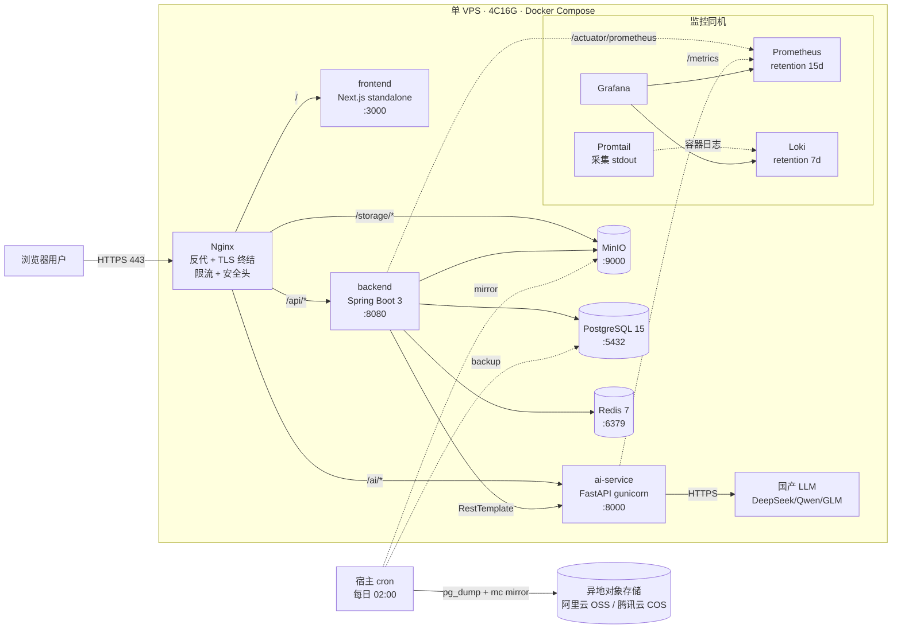

# 03 — 生产部署方案

**审查日期：** 2026-05-09
**项目 commit 基线：** `0f08c91 ds version`
**目标场景：** 10K 总注册 / DAU 1-2K / 峰值并发 ~100 / 月 PV 100w-300w
**起点：** 现有 `docker-compose.yml`（7 服务，单文件 92 行）+ `nginx/nginx.conf`（仅 80 端口、52 行）
**目标：** 单 VPS（4C8G 起步、推荐 4C16G）+ 加固后的 `docker-compose.prod.yml` + Nginx HTTPS + 监控 + 备份
**前置文档：** `01-architecture-audit.md`（13 条 P0 阻塞）、`02-optimization-roadmap.md`（P0/P1 任务清单）

> 本文档不修改 `docker-compose.yml` / `nginx/nginx.conf`（dev 文件保持原样），而是给出**全新的生产侧配置模板与部署流程**。所有 yaml/nginx/sh 片段均可直接复制使用。

---

## 0. 部署方案的指导原则

在展开具体编排与配置之前，先明确本方案遵循的几条基本原则，便于后续每条配置的取舍都有据可查。

**第一条：单 VPS 起步、不过度设计。** 10K 注册的轻量场景下，业务侧实际峰值并发约 100，这个量级根本不需要 Kubernetes、Service Mesh、跨可用区高可用这些重量级设施。强行套用大型架构只会带来巨大的运维负担，把本可以专注业务迭代的人力消耗在维护编排平台上。本方案基于**单 VPS + Docker Compose** 起步，扩容路径明确（详见 §8），未来真正撞上单机瓶颈再迁移到 K8s 也来得及——届时业务模型已成熟、容量数据已积累，迁移路径反而更清晰。

**第二条：所有配置可文本化、可 git 管控、可一键重建。** 整个生产部署所需的全部状态（除 secret）都应该在 git 仓库中以文本形式存在：`docker-compose.prod.yml`、`nginx.prod.conf`、`postgresql.prod.conf`、`backup.sh`、`.env.prod.example`。如果生产 VPS 整机宕机或被勒索病毒锁住，运维只需要拿到最近的备份 + 这些配置文件，就能在 30 分钟内在新机器上拉起完整环境。任何"在生产机上手改某个配置文件"的操作都属于偏差，必须立刻同步回仓库。

**第三条：所有变更可灰度、可回滚、可观测。** 上线不是一锤子买卖。本方案在 §7 给出了滚动发布的 CI 流水线，每次部署带版本 tag，回滚只需要把 `RELEASE_TAG` 回写并重启；§6 给出监控接入，每次发布后 5 分钟内可在 Grafana 上观察核心指标变化；§5 的备份保证最坏情况下数据不会丢。

**第四条：先把已知的洞堵上，再谈优化。** `01-architecture-audit.md` 列出了 13 条 P0 阻塞，其中 8 条与部署/配置直接相关（HTTPS 缺失、JWT/数据库密码硬编码、actuator 全开、CORS 过宽、限流缺失、端口直暴、Swagger 公网暴露、token 存 localStorage）。本方案第 2-3 章的全部配置都是为了一次性堵掉这些洞；第 4-9 章则是在堵洞之后才有意义的进阶治理。两者顺序不能颠倒——先把 nginx/443 + 强密码部署上去再谈监控告警，否则就是把摄像头装在不锁门的房子里。

---

## 1. 推荐目标架构

### 1.1 部署拓扑



宿主仅暴露 80/443 两个端口；其余服务在 docker bridge 内网通信（`internal` 网络）。监控栈与业务栈同机部署，但 Prometheus 与 Loki 通过独立 `internal_monitoring` 网络与业务网络互通，避免业务侧把监控端点意外暴露到公网。备份脚本由宿主 crontab 触发，跨网络抓取容器内数据后异地推送，不引入额外的容器内 cron 复杂度。

与现有 dev 拓扑相比，生产拓扑的关键变化有三点：第一，所有数据库与中间件不再向宿主暴露端口，攻击面从原来的"公网可达 7 个端口"收缩为"公网可达 nginx 两个端口"；第二，前端构建时通过 docker build args 写死生产域名，不再依赖运行时环境变量，避免 Next.js standalone 在 SSR 阶段拿不到 `NEXT_PUBLIC_*` 而走错 origin；第三，MinIO 不再独立暴露，而是通过 nginx `/storage/` 路径反代，浏览器侧 URL 永远是同一域名下的子路径，CORS 与 Cookie 行为统一。

### 1.2 单 VPS 资源规划（保守上限）

| 服务 | CPU 限制 | 内存限制 | 备注 |
|---|---|---|---|
| nginx | 0.2 | 128M | 反代 + TLS 终结，IO bound |
| frontend | 0.5 | 512M | Next.js standalone runtime |
| backend | 1.5 | 2.5G | Spring Boot；JVM `-Xmx2g -Xms512m` |
| ai-service | 1.0 | 1.0G | gunicorn 2 worker + uvicorn |
| postgres | 0.8 | 1.5G | shared_buffers 512M |
| redis | 0.2 | 256M | maxmemory 200M + LRU |
| minio | 0.3 | 512M | 单 drive，约 500GB 块设备 |
| prometheus | 0.2 | 512M | retention 15d |
| grafana | 0.1 | 256M | dashboard only |
| loki | 0.2 | 384M | retention 7d |
| promtail | 0.1 | 128M | tail json-file driver |
| **业务栈合计** | **3.7** | **6.4G** | |
| **监控栈合计** | **0.6** | **1.3G** | |
| **保留给系统/cron/临时任务** | **0.7** | **2.3G** | 含 backup `pg_dump` 临时驻留 |
| **总合计** | **5.0** | **10.0G** | |

**结论：4C8G 已严重贴近上限**（5C 超核 + 10G 超出），尤其在 backup 启动时（`pg_dump` 临时占用约 500MB + `mc mirror` 缓冲）会触发 swap，连带后端 GC 暂停时间放大数倍。**强烈推荐 4C16G** 起步；若坚持 4C8G，应把监控栈拆到单独的 1C2G 小机或托管 Grafana Cloud，留给业务栈完整 7-8G 内存。

注意上表的 CPU 列是 docker `deploy.resources.limits.cpus` 限制值，不是平均占用。日常平均占用约为 limit 的 20-40%，业务突发时短时打满 limit 也不会影响其他容器（cgroup 隔离）。内存列同理是上限，OOM 时被该限制 kill 不会拖累其他容器，但前提是 limit 已设——dev 配置全无 limit，一旦 ai-service 跑大模型推理或解析大 PDF 失控吃满内存，会把整机 OOM 直接触发 docker daemon 重启所有容器，这是生产绝对不能接受的。

这些现象有一个共同特征：**指标变化是渐进的而非突发的**，运维有充足窗口准备升配。建议在 Grafana 上配三块趋势面板（DAU 周环比、p99 周趋势、AI 调用月增长），每周一邮件简报，避免突发升配。

### 1.3 升级到 8C16G 的触发条件

- DAU 持续 > 3K 或 backend HTTP `p99 > 1s` 持续一周；
- AI 调用量 > 500 次/分钟（缓存命中后仍如此）；
- Postgres 连接池 `hikaricp_connections_active / max ≥ 80%` 持续告警；
- Postgres 单表行数 > 1000w 或库大小 > 50GB；
- MinIO 占用 > 1TB（同步迁移到对象存储服务，参见 §8.2）。

---

## 2. docker-compose.prod.yml 完整设计

### 2.1 与 dev 版的关键差异

| 维度 | dev (`docker-compose.yml`) | prod (`docker-compose.prod.yml`) |
|---|---|---|
| 端口暴露 | 7 服务全部 `ports:` 直暴宿主 | 仅 `nginx` 暴 80/443，其余靠 `internal` 网络互通 |
| Secret | 写死在文件 | `env_file: .env.prod` 注入；`.env.prod` 入 `.gitignore` |
| Healthcheck | 全无 | 6 个有状态服务全部配置 |
| Restart policy | 全无 | 统一 `restart: unless-stopped` |
| 资源限制 | 全无 | 每服务 `deploy.resources.limits` |
| 日志驱动 | docker 默认（无限增长） | `json-file` + `max-size:50m, max-file:5` |
| MinIO 暴露 | 直暴 9000/9001 | 走 nginx `/storage/` 路径反代，console 关闭外网 |
| 网络 | 默认 bridge | 自定义 `internal` + `internal_monitoring` |
| 镜像版本 | 部分用 `:latest` | 全部固化（如 `minio/minio:RELEASE.2025-09-07T16-13-09Z`） |

这张差异表里最容易被忽视的是"depends_on 的 condition"——dev 编排里 `depends_on: [postgres, redis, minio, ai-service]` 仅保证启动顺序，不等待健康。结果就是 backend 启动时 postgres 还在初始化、Flyway 连接重试浪费 30 秒。生产编排必须用 `condition: service_healthy`，配合每个服务的 healthcheck，让启动过程像多米诺骨牌一样可控。

另一个 dev 配置的隐患是镜像 tag 用了 `:latest`，下次重启可能拉到新版本带来未知行为变更。生产编排显式固化所有镜像版本（包括 nginx 与 minio），把"什么时候升级基础镜像"变成显式决策而非默默发生。

### 2.2 完整 yaml 草稿

```yaml
# docker-compose.prod.yml
# 用法：docker compose -f docker-compose.prod.yml --env-file .env.prod up -d

x-logging: &default-logging
  driver: json-file
  options:
    max-size: "50m"
    max-file: "5"

services:
  postgres:
    image: postgres:15-alpine
    restart: unless-stopped
    env_file: .env.prod
    environment:
      POSTGRES_DB: ${POSTGRES_DB}
      POSTGRES_USER: ${POSTGRES_USER}
      POSTGRES_PASSWORD: ${POSTGRES_PASSWORD}
    volumes:
      - postgres_data:/var/lib/postgresql/data
      - ./postgres/postgresql.prod.conf:/etc/postgresql/postgresql.conf:ro
    command: ["postgres", "-c", "config_file=/etc/postgresql/postgresql.conf"]
    networks: [internal]
    healthcheck:
      test: ["CMD-SHELL", "pg_isready -U ${POSTGRES_USER} -d ${POSTGRES_DB}"]
      interval: 10s
      timeout: 5s
      retries: 5
      start_period: 20s
    deploy:
      resources:
        limits: { cpus: "0.8", memory: 1500M }
    logging: *default-logging

  redis:
    image: redis:7-alpine
    restart: unless-stopped
    env_file: .env.prod
    command:
      - redis-server
      - --requirepass
      - ${REDIS_PASSWORD}
      - --maxmemory
      - 200mb
      - --maxmemory-policy
      - allkeys-lru
      - --appendonly
      - "yes"
    volumes:
      - redis_data:/data
    networks: [internal]
    healthcheck:
      test: ["CMD-SHELL", "redis-cli -a $${REDIS_PASSWORD} ping | grep PONG"]
      interval: 10s
      timeout: 3s
      retries: 5
    deploy:
      resources:
        limits: { cpus: "0.2", memory: 256M }
    logging: *default-logging

  minio:
    image: minio/minio:RELEASE.2025-09-07T16-13-09Z
    restart: unless-stopped
    env_file: .env.prod
    environment:
      MINIO_ROOT_USER: ${MINIO_ROOT_USER}
      MINIO_ROOT_PASSWORD: ${MINIO_ROOT_PASSWORD}
      MINIO_BROWSER: "off"   # 生产关闭 Web 控制台
    volumes:
      - minio_data:/data
    command: server /data
    networks: [internal]
    healthcheck:
      test: ["CMD-SHELL", "curl -f http://localhost:9000/minio/health/live || exit 1"]
      interval: 15s
      timeout: 5s
      retries: 5
      start_period: 30s
    deploy:
      resources:
        limits: { cpus: "0.3", memory: 512M }
    logging: *default-logging

  ai-service:
    build:
      context: ./ai-service
      dockerfile: Dockerfile
    image: study11408/ai-service:${RELEASE_TAG:-latest}
    restart: unless-stopped
    env_file: .env.prod
    environment:
      DEBUG: "false"
      LLM_PROVIDER: ${LLM_PROVIDER}
      OPENAI_API_KEY: ${OPENAI_API_KEY}
      OPENAI_BASE_URL: ${OPENAI_BASE_URL}
      OPENAI_MODEL: ${OPENAI_MODEL}
      REDIS_HOST: redis
      REDIS_PASSWORD: ${REDIS_PASSWORD}
      UVICORN_WORKERS: "2"
    networks: [internal]
    healthcheck:
      test: ["CMD-SHELL", "python -c 'import urllib.request; urllib.request.urlopen(\"http://localhost:8000/ai/health\")' || exit 1"]
      interval: 15s
      timeout: 5s
      retries: 5
      start_period: 30s
    deploy:
      resources:
        limits: { cpus: "1.0", memory: 1024M }
    logging: *default-logging

  backend:
    build:
      context: ./backend
      dockerfile: Dockerfile
    image: study11408/backend:${RELEASE_TAG:-latest}
    restart: unless-stopped
    env_file: .env.prod
    environment:
      SPRING_PROFILES_ACTIVE: prod
      SPRING_DATASOURCE_URL: jdbc:postgresql://postgres:5432/${POSTGRES_DB}
      SPRING_DATASOURCE_USERNAME: ${POSTGRES_USER}
      SPRING_DATASOURCE_PASSWORD: ${POSTGRES_PASSWORD}
      SPRING_DATA_REDIS_HOST: redis
      SPRING_DATA_REDIS_PORT: "6379"
      SPRING_DATA_REDIS_PASSWORD: ${REDIS_PASSWORD}
      APP_JWT_SECRET: ${APP_JWT_SECRET}
      APP_JWT_EXPIRATION: "3600000"          # 1 小时（生产从 24h 缩短）
      APP_JWT_REFRESH_EXPIRATION: "86400000" # 24 小时（生产从 7d 缩短）
      APP_MINIO_ENDPOINT: http://minio:9000
      APP_MINIO_ACCESS_KEY: ${MINIO_ROOT_USER}
      APP_MINIO_SECRET_KEY: ${MINIO_ROOT_PASSWORD}
      APP_MINIO_BUCKET: ${APP_MINIO_BUCKET}
      APP_MINIO_PUBLIC_ENDPOINT: https://${APP_DOMAIN}/storage
      APP_AI_SERVICE_URL: http://ai-service:8000
      APP_CORS_ALLOWED_ORIGINS: https://${APP_DOMAIN}
      JAVA_TOOL_OPTIONS: "-Xms512m -Xmx2g -XX:+UseG1GC -XX:MaxGCPauseMillis=200 -Duser.timezone=Asia/Shanghai"
    depends_on:
      postgres: { condition: service_healthy }
      redis:    { condition: service_healthy }
      minio:    { condition: service_healthy }
      ai-service: { condition: service_healthy }
    networks: [internal]
    healthcheck:
      test: ["CMD-SHELL", "wget -qO- http://localhost:8080/api/actuator/health | grep -q UP || exit 1"]
      interval: 15s
      timeout: 5s
      retries: 6
      start_period: 60s
    deploy:
      resources:
        limits: { cpus: "1.5", memory: 2560M }
    logging: *default-logging

  frontend:
    build:
      context: ./frontend
      dockerfile: Dockerfile
      args:
        NEXT_PUBLIC_API_BASE_URL: https://${APP_DOMAIN}/api
    image: study11408/frontend:${RELEASE_TAG:-latest}
    restart: unless-stopped
    networks: [internal]
    depends_on:
      backend: { condition: service_healthy }
    healthcheck:
      test: ["CMD-SHELL", "wget -qO- http://localhost:3000/ > /dev/null || exit 1"]
      interval: 30s
      timeout: 5s
      retries: 5
      start_period: 30s
    deploy:
      resources:
        limits: { cpus: "0.5", memory: 512M }
    logging: *default-logging

  nginx:
    image: nginx:1.27-alpine
    restart: unless-stopped
    ports:
      - "80:80"
      - "443:443"
    volumes:
      - ./nginx/nginx.prod.conf:/etc/nginx/conf.d/default.conf:ro
      - ./nginx/snippets:/etc/nginx/snippets:ro
      - certbot_etc:/etc/letsencrypt:ro
      - certbot_webroot:/var/www/certbot:ro
    depends_on:
      frontend:   { condition: service_healthy }
      backend:    { condition: service_healthy }
      ai-service: { condition: service_healthy }
    networks: [internal]
    deploy:
      resources:
        limits: { cpus: "0.2", memory: 128M }
    logging: *default-logging

  certbot:
    image: certbot/certbot:v2.11.0
    restart: "no"
    volumes:
      - certbot_etc:/etc/letsencrypt
      - certbot_webroot:/var/www/certbot
    entrypoint: /bin/sh
    command: -c "trap exit TERM; while :; do certbot renew --quiet --webroot -w /var/www/certbot && nginx -s reload 2>/dev/null; sleep 12h; done"

volumes:
  postgres_data:
  redis_data:
  minio_data:
  certbot_etc:
  certbot_webroot:

networks:
  internal:
    driver: bridge
```

几个关键点说明：

**healthcheck 的 start_period 与 retries**。Spring Boot 冷启动约 7 秒（参见 `05-local-validation.md`），加上 Flyway 迁移、JPA 元数据缓存、Hikari 预热，首次响应 `/actuator/health` 通常需要 20-40 秒。把 `start_period` 设到 60 秒避免假阴性触发误重启；retries=6 保证瞬时网络抖动不会被误判。Postgres/Redis/MinIO 启动较快，20-30 秒 start_period 足够。

**MinIO Browser 关闭**。生产编排显式 `MINIO_BROWSER=off`，关闭 9001 端口的 Web 控制台。运维需要排查时通过 `mc` 命令行或临时打开浏览器。这是因为 MinIO 控制台默认无 IP 白名单，一旦在 nginx 上误暴露相当于把对象存储管理界面挂到公网。

**JVM heap 显式上限 + G1GC**。`JAVA_TOOL_OPTIONS` 设 `-Xmx2g` 与容器 mem limit 2.5G 之间留 500MB 给堆外（metaspace、direct buffer、JIT code cache、线程栈）；G1GC 在 2-4G 堆上比 ParallelGC 暂停更平滑，适合在线服务。`-Duser.timezone=Asia/Shanghai` 与 PG `timezone=Asia/Shanghai`、Jackson `time-zone=Asia/Shanghai` 三处统一，避免 `01-architecture-audit.md` §2.2 提到的"今天/连续天数算错"问题。

**RELEASE_TAG 的来源**。CI 流水线（详见 §7）每次构建用 `$(date +%Y.%m.%d)-${GITHUB_RUN_NUMBER}` 生成 tag，写入镜像与 `.env.prod`。回滚时只需把 `.env.prod` 中 `RELEASE_TAG` 改回上一个值，重新 `docker compose pull && up -d` 即可，整个过程 < 1 分钟。

**certbot 续签策略**。compose 中的 `certbot` service 后台轮询，每 12 小时执行一次 `certbot renew`。Let's Encrypt 证书有效期 90 天，距过期 < 30 天才会真正续签，所以这个轮询窗口足够宽。续签后通过 `nginx -s reload` 触发热加载（无 downtime）。如果想更稳妥，可以把 reload 改成在宿主上的 `docker compose -f docker-compose.prod.yml exec nginx nginx -s reload`，但跨容器执行需要挂 docker socket 权限。

### 2.3 .env.prod.example 模板

```env
# ===== 域名 =====
APP_DOMAIN=study11408.example.com

# ===== PostgreSQL =====
POSTGRES_DB=study11408
POSTGRES_USER=study11408_prod
# 32+ 字符强密码：openssl rand -base64 32 | tr -d '/+=' | cut -c1-32
POSTGRES_PASSWORD=CHANGE_ME_pg_strong_password_32_chars

# ===== Redis =====
# 32+ 字符强密码
REDIS_PASSWORD=CHANGE_ME_redis_strong_password_32_chars

# ===== JWT =====
# 必须 64+ 字符：openssl rand -base64 64 | tr -d '\n'
APP_JWT_SECRET=CHANGE_ME_replace_with_openssl_rand_base64_64_output
APP_JWT_EXPIRATION=3600000
APP_JWT_REFRESH_EXPIRATION=86400000

# ===== MinIO =====
MINIO_ROOT_USER=study11408_minio
MINIO_ROOT_PASSWORD=CHANGE_ME_minio_strong_password_32_chars
APP_MINIO_BUCKET=study11408

# ===== LLM（默认 DeepSeek 快通道，兼容 OpenAI SDK，详见 doc 4） =====
LLM_PROVIDER=openai
OPENAI_API_KEY=sk-CHANGE_ME_deepseek_or_openai_key
OPENAI_BASE_URL=https://api.deepseek.com/v1
OPENAI_MODEL=deepseek-chat

# ===== CORS =====
APP_CORS_ALLOWED_ORIGINS=https://study11408.example.com

# ===== Release =====
RELEASE_TAG=2026.05.09-1

# ===== 备份 OSS（可选，备份脚本读） =====
BACKUP_OSS_BUCKET=study11408-backup
BACKUP_OSS_ENDPOINT=oss-cn-hangzhou.aliyuncs.com
BACKUP_OSS_ACCESS_KEY=CHANGE_ME
BACKUP_OSS_SECRET_KEY=CHANGE_ME
```

入仓时只提交 `.env.prod.example`，`.env.prod` 加入 `.gitignore`。运维侧通过密码管理工具（1Password / Bitwarden / 自建 Vaultwarden）保管真实 `.env.prod`，并在团队成员变动时定期轮换。

特别提醒两点：第一，本仓库历史中已经有明文 JWT secret 与数据库密码（`application.yml:43,11`，详见 `01-architecture-audit.md` §3.1.1），即使本次 P0 修完，git 历史里这些密钥仍可被任意 clone 读取，因此**必须在切换到 .env.prod 后重新随机生成所有密钥**，不能继续使用历史中的值。第二，部分 PaaS 平台（如阿里云函数计算）允许把 secret 作为函数级环境变量，比 docker-compose 文件加密更安全；如果未来迁移，可以把当前 `.env.prod` 拆成"PaaS 平台原生 secret"（pg/jwt/llm 等核心密钥）+"配置文件可见参数"（域名、超时、worker 数量等）两部分。

---

## 3. Nginx 生产配置

### 3.1 完整 nginx.prod.conf 草稿

```nginx
# /etc/nginx/conf.d/default.conf

upstream java_backend { server backend:8080; keepalive 32; }
upstream ai_service   { server ai-service:8000; keepalive 16; }
upstream frontend     { server frontend:3000; keepalive 16; }
upstream minio        { server minio:9000; keepalive 16; }

# 限流 zones（10MB 内存约存 16w 个 IP 状态）
limit_req_zone $binary_remote_addr zone=api_general:10m rate=30r/s;
limit_req_zone $binary_remote_addr zone=api_login:10m rate=5r/m;
limit_req_zone $binary_remote_addr zone=ai_call:10m   rate=10r/m;
limit_conn_zone $binary_remote_addr zone=conn_per_ip:10m;

# 日志格式（含 traceId、上游耗时）
log_format prod '$remote_addr - $remote_user [$time_iso8601] '
                '"$request" $status $body_bytes_sent '
                'rt=$request_time urt=$upstream_response_time '
                'tid="$http_x_trace_id" "$http_user_agent"';
access_log /var/log/nginx/access.log prod;

# HTTP → HTTPS（保留 ACME challenge 路径）
server {
    listen 80;
    server_name study11408.example.com;
    location /.well-known/acme-challenge/ { root /var/www/certbot; }
    location / { return 301 https://$host$request_uri; }
}

# HTTPS 主入口
server {
    listen 443 ssl;
    http2 on;
    server_name study11408.example.com;

    ssl_certificate     /etc/letsencrypt/live/study11408.example.com/fullchain.pem;
    ssl_certificate_key /etc/letsencrypt/live/study11408.example.com/privkey.pem;
    ssl_protocols TLSv1.2 TLSv1.3;
    ssl_ciphers ECDHE-ECDSA-AES128-GCM-SHA256:ECDHE-RSA-AES128-GCM-SHA256:ECDHE-ECDSA-AES256-GCM-SHA384:ECDHE-RSA-AES256-GCM-SHA384;
    ssl_prefer_server_ciphers on;
    ssl_session_cache shared:SSL:10m;
    ssl_session_timeout 1h;
    ssl_stapling on;
    ssl_stapling_verify on;

    # 安全头（详见 P1-08，与上线 checklist 对齐）
    add_header Strict-Transport-Security "max-age=31536000; includeSubDomains; preload" always;
    add_header X-Frame-Options "SAMEORIGIN" always;
    add_header X-Content-Type-Options "nosniff" always;
    add_header Referrer-Policy "strict-origin-when-cross-origin" always;
    add_header Content-Security-Policy "default-src 'self'; script-src 'self' 'unsafe-inline' 'unsafe-eval'; style-src 'self' 'unsafe-inline'; img-src 'self' data: blob: https://study11408.example.com; connect-src 'self' https://study11408.example.com; font-src 'self' data:; frame-ancestors 'self'" always;
    add_header Permissions-Policy "camera=(), microphone=(), geolocation=()" always;

    # gzip
    gzip on;
    gzip_vary on;
    gzip_proxied any;
    gzip_comp_level 6;
    gzip_min_length 1024;
    gzip_types text/plain text/css application/json application/javascript application/xml application/xml+rss text/javascript image/svg+xml;

    client_max_body_size 100M;
    client_body_timeout 60s;
    proxy_connect_timeout 5s;
    proxy_send_timeout 30s;
    proxy_read_timeout 30s;

    limit_conn conn_per_ip 50;

    # ----- 受限敏感接口（先匹配，order matters）-----
    location = /api/auth/login {
        limit_req zone=api_login burst=10 nodelay;
        proxy_pass http://java_backend;
        include /etc/nginx/snippets/proxy_common.conf;
    }
    location = /api/auth/register {
        limit_req zone=api_login burst=5 nodelay;
        proxy_pass http://java_backend;
        include /etc/nginx/snippets/proxy_common.conf;
    }
    location = /api/auth/refresh {
        limit_req zone=api_login burst=10 nodelay;
        proxy_pass http://java_backend;
        include /etc/nginx/snippets/proxy_common.conf;
    }

    # ----- AI 接口（更严限流 + 更长超时）-----
    location /ai/ {
        limit_req zone=ai_call burst=20 nodelay;
        proxy_read_timeout 120s;
        proxy_send_timeout 120s;
        proxy_pass http://ai_service;
        include /etc/nginx/snippets/proxy_common.conf;
    }

    # ----- 后端通用 API -----
    location /api/ {
        limit_req zone=api_general burst=50 nodelay;
        proxy_pass http://java_backend;
        include /etc/nginx/snippets/proxy_common.conf;
    }

    # ----- MinIO 公网下载（仅 GET / HEAD，白名单 bucket）-----
    location ~* ^/storage/(study11408)/(.+)$ {
        limit_except GET HEAD { deny all; }
        proxy_pass http://minio/$1/$2;
        proxy_set_header Host $host;
        proxy_buffering off;   # 大文件流式
        proxy_request_buffering off;
        client_max_body_size 0;
    }

    # ----- 生产关闭 swagger / openapi（防 API 形状泄漏）-----
    location ~ ^/(api/)?(swagger-ui|v3/api-docs) { return 404; }

    # ----- actuator 仅内网（监控访问由 docker network 走，不经 nginx）-----
    location /api/actuator/ { deny all; return 404; }

    # ----- 静态前端 -----
    location / {
        proxy_pass http://frontend;
        proxy_http_version 1.1;
        proxy_set_header Upgrade $http_upgrade;
        proxy_set_header Connection "upgrade";
        include /etc/nginx/snippets/proxy_common.conf;
    }
}
```

`/etc/nginx/snippets/proxy_common.conf`：

```nginx
proxy_http_version 1.1;
proxy_set_header Host $host;
proxy_set_header X-Real-IP $remote_addr;
proxy_set_header X-Forwarded-For $proxy_add_x_forwarded_for;
proxy_set_header X-Forwarded-Proto $scheme;
proxy_set_header X-Trace-Id $http_x_trace_id;
proxy_set_header Connection "";
```

### 3.2 Let's Encrypt 首次签发流程

DNS 必须先把域名 A 记录解析到 VPS 公网 IP，且阿里云/腾讯云安全组放行 80/443。

```bash
# 1. 准备临时 nginx 仅监听 80（让 webroot 验证可达）
mkdir -p ./certbot_webroot
cat > ./nginx/nginx.bootstrap.conf <<'EOF'
server {
    listen 80;
    server_name study11408.example.com;
    location /.well-known/acme-challenge/ { root /var/www/certbot; }
    location / { return 200 "bootstrap"; }
}
EOF

# 2. 启临时 nginx
docker compose -f docker-compose.prod.yml --env-file .env.prod up -d nginx

# 3. 首次签发
docker compose -f docker-compose.prod.yml run --rm certbot \
  certbot certonly --webroot -w /var/www/certbot \
  -d study11408.example.com \
  --email admin@example.com --agree-tos --no-eff-email --non-interactive

# 4. 切换到正式 nginx.prod.conf 并 reload
docker compose -f docker-compose.prod.yml restart nginx
docker compose -f docker-compose.prod.yml up -d   # 拉起其余服务

# 5. 自动续签由 compose 中的 certbot service 接管（每 12h renew）
```

证书有效期 90 天；compose 中的 `certbot` service 后台轮询，距过期 30 天内会自动续签并触发 nginx reload（通过同一 docker 网络的 `docker exec` 也可，更稳的方式是把 reload 命令包到 deploy hook 中）。建议同时配置外部健康检查（如 UptimeRobot 免费版每 5 分钟检测一次 `https://${APP_DOMAIN}/api/actuator/health`），证书过期或服务宕机会立刻邮件告警，不依赖内部监控自我发现。

关于安全头有几处需要解释取舍：`Content-Security-Policy` 中保留了 `'unsafe-inline'` 与 `'unsafe-eval'`，这是 Next.js 16 SSR 阶段产生的内联脚本与 React Hot Reload 的硬性需求，短期无法去除；可以接受这个状态作为基线，未来通过 CSP nonce 或 Trusted Types 渐进收紧。`X-Frame-Options: SAMEORIGIN` 比 `DENY` 更宽松一档，是为了允许未来在自家域名内嵌 iframe（比如知识图谱预览），如果业务确认无此需求建议直接 `DENY`。`Permissions-Policy` 主动关闭了 camera/microphone/geolocation，避免某些第三方 SDK 偷偷申请权限。

---

## 4. PostgreSQL 调优

`./postgres/postgresql.prod.conf`（mount 进容器）：

```conf
# 连接
listen_addresses = '*'
max_connections = 200
superuser_reserved_connections = 5

# 内存（基于容器 1.5G mem limit）
shared_buffers = 512MB
effective_cache_size = 1GB
work_mem = 16MB
maintenance_work_mem = 256MB
wal_buffers = 32MB
temp_buffers = 16MB

# WAL / Checkpoint
wal_level = replica
max_wal_size = 1GB
min_wal_size = 80MB
checkpoint_completion_target = 0.9
checkpoint_timeout = 15min

# Planner（SSD）
random_page_cost = 1.1
effective_io_concurrency = 200
default_statistics_target = 100

# 日志（生产建议）
log_min_duration_statement = 500ms       # 慢查询 ≥500ms 入日志
log_checkpoints = on
log_connections = off
log_disconnections = off
log_lock_waits = on
log_temp_files = 10MB
log_line_prefix = '%t [%p] %u@%d/%a '
log_timezone = 'Asia/Shanghai'

# 时区与 locale
timezone = 'Asia/Shanghai'
datestyle = 'iso, ymd'
lc_messages = 'C'

# 自动清理
autovacuum = on
autovacuum_max_workers = 3
autovacuum_naptime = 30s
```

| 参数 | 默认 | 推荐 | 说明 |
|---|---|---|---|
| shared_buffers | 128M | 512M | RAM 25% |
| effective_cache_size | 4G | 1G | 容器 mem 限制内估算 |
| work_mem | 4M | 16M | sort/hash 单操作内存上限 |
| maintenance_work_mem | 64M | 256M | VACUUM / CREATE INDEX 加速 |
| max_connections | 100 | 200 | HikariCP 30 × 多副本余量 |
| checkpoint_completion_target | 0.5 | 0.9 | 平滑刷盘减峰值 IO |
| random_page_cost | 4.0 | 1.1 | SSD 随机读接近顺序读 |
| log_min_duration_statement | -1 | 500ms | 慢查询监控基础 |

HikariCP 上限：`application-prod.yml` 设 `spring.datasource.hikari.maximum-pool-size: 30, minimum-idle: 5, leak-detection-threshold: 60000`，30 池 × 单副本 + 5 预留运维连接 < 200，足够余量横向加 1 个 backend 副本。`leak-detection-threshold: 60000` 表示连接借出超过 60 秒未归还就打印 stack trace 警告，能立刻定位 N+1 或忘 close 的代码路径。

关于 `shared_buffers` 与 `effective_cache_size` 的关系常被误解：前者是 PG 自己管理的实际内存缓冲，后者只是告诉规划器"操作系统页缓存大概有多少 MB 可以用"，并不真实分配。在容器环境下，`effective_cache_size` 应略小于宿主页缓存可用量与容器 mem limit 的较小值，过大会让规划器低估 IO 成本、过小会让规划器高估 IO 成本走错索引。1GB 是基于 1.5G 容器 limit 的保守估计。

`log_min_duration_statement = 500ms` 是慢查询监控的核心配置，配合 §6 中的 postgres-exporter 把 `pg_stat_statements` 数据拉到 Prometheus，可以画出 Top10 慢查询面板，主动发现 N+1。这个配置如果设 0 会把所有 SQL 都打印，日志量会暴涨，500ms 是对线上业务比较合理的阈值。

---

## 5. 备份与恢复

### 5.1 备份脚本

`/opt/study11408/scripts/backup.sh`：

```bash
#!/usr/bin/env bash
# 每日全量备份：Postgres dump + MinIO mirror，本地 30 天，异地 90 天
set -euo pipefail

BASE=/opt/study11408
BACKUP_DIR=$BASE/backups
LOG=/var/log/study11408-backup.log
DATE=$(date +%Y%m%d_%H%M%S)
RETENTION_DAYS=30

cd "$BASE"
source .env.prod

mkdir -p "$BACKUP_DIR/pg" "$BACKUP_DIR/minio"

echo "[$(date -Iseconds)] backup start" >> "$LOG"

# ---------- Postgres ----------
PG_FILE="$BACKUP_DIR/pg/pg_${DATE}.dump"
docker compose -f docker-compose.prod.yml exec -T postgres \
  pg_dump -U "$POSTGRES_USER" -d "$POSTGRES_DB" -Fc \
  > "$PG_FILE"
gzip -f "$PG_FILE"   # → pg_${DATE}.dump.gz
PG_SIZE=$(du -h "${PG_FILE}.gz" | cut -f1)
echo "[$(date -Iseconds)] pg dump done size=$PG_SIZE" >> "$LOG"

# ---------- MinIO ----------
# mc 需提前 alias：docker run --rm minio/mc alias set local http://minio:9000 ...
docker run --rm --network=11408study_internal \
  -v $BASE/backups/minio:/backup \
  minio/mc:latest \
  mirror --overwrite --remove minio/$APP_MINIO_BUCKET /backup/$APP_MINIO_BUCKET-$DATE
echo "[$(date -Iseconds)] minio mirror done" >> "$LOG"

# ---------- 异地（阿里云 OSS 示例） ----------
if [ -n "${BACKUP_OSS_BUCKET:-}" ]; then
  docker run --rm \
    -e ALIBABA_CLOUD_ACCESS_KEY_ID=$BACKUP_OSS_ACCESS_KEY \
    -e ALIBABA_CLOUD_ACCESS_KEY_SECRET=$BACKUP_OSS_SECRET_KEY \
    -v $BACKUP_DIR:/data \
    aliyun/ossutil:latest \
    cp -r /data/pg/pg_${DATE}.dump.gz oss://$BACKUP_OSS_BUCKET/pg/ \
    -e $BACKUP_OSS_ENDPOINT
  echo "[$(date -Iseconds)] oss upload done" >> "$LOG"
fi

# ---------- 本地清理 30 天前 ----------
find "$BACKUP_DIR/pg"    -name 'pg_*.dump.gz' -mtime +$RETENTION_DAYS -delete
find "$BACKUP_DIR/minio" -maxdepth 1 -type d -name "${APP_MINIO_BUCKET}-*" -mtime +$RETENTION_DAYS -exec rm -rf {} +
echo "[$(date -Iseconds)] cleanup done" >> "$LOG"
```

`chmod +x /opt/study11408/scripts/backup.sh` 后加 cron：

```cron
# /etc/crontab
0 2 * * * root /opt/study11408/scripts/backup.sh
```

### 5.2 恢复脚本

`/opt/study11408/scripts/restore.sh`：

```bash
#!/usr/bin/env bash
# 用法：restore.sh /opt/study11408/backups/pg/pg_20260509_020000.dump.gz [target_db]
set -euo pipefail

DUMP="$1"
TARGET_DB="${2:-study11408_restore_test}"

cd /opt/study11408
source .env.prod

echo ">>> 创建目标库 $TARGET_DB"
docker compose -f docker-compose.prod.yml exec -T postgres \
  psql -U "$POSTGRES_USER" -d postgres -c "DROP DATABASE IF EXISTS $TARGET_DB; CREATE DATABASE $TARGET_DB OWNER $POSTGRES_USER;"

echo ">>> 还原 $DUMP → $TARGET_DB"
zcat "$DUMP" | docker compose -f docker-compose.prod.yml exec -T postgres \
  pg_restore -U "$POSTGRES_USER" -d "$TARGET_DB" --no-owner --role="$POSTGRES_USER"

echo ">>> 校验"
docker compose -f docker-compose.prod.yml exec -T postgres \
  psql -U "$POSTGRES_USER" -d "$TARGET_DB" -c "SELECT count(*) AS users FROM users; SELECT count(*) AS nodes FROM knowledge_nodes;"
```

### 5.3 月度恢复演练（强制）

每月 1 日 03:00 自动跑一次还原到测试库 + 行数对比，记录入 `release-checklist`：

```cron
0 3 1 * * root /opt/study11408/scripts/restore.sh \
  $(ls -t /opt/study11408/backups/pg/pg_*.dump.gz | head -1) \
  study11408_restore_test >> /var/log/study11408-restore-drill.log 2>&1
```

异地备份建议落到阿里云 OSS / 腾讯云 COS 标准存储 + 跨区域复制 + 服务端 KMS 加密，对应费用见 §9。"备份不可恢复就等于没有备份"——很多团队栽在备份脚本一直在跑，但从来没真的还原过，到要用的时候才发现 dump 损坏或脚本路径写错。本方案把月度恢复演练强制写入 cron，并在 §10 上线 checklist 中明确要求"上线前至少跑过一次完整还原 + 行数对比"，否则视为备份未就绪。

另一个容易出错的点是异地备份的访问凭证。很多团队会图省事让备份脚本与业务用同一组 AccessKey，一旦业务侧凭证泄漏，攻击者顺着 OSS 凭证可以连备份一起删干净。本方案 `.env.prod` 中专门划出一组 `BACKUP_OSS_ACCESS_KEY` / `BACKUP_OSS_SECRET_KEY`，建议在阿里云 RAM 中只赋予该 AK 备份 bucket 的 PutObject 权限（不给 DeleteObject、不给业务 bucket 任何权限），最大限度隔离爆炸半径。

---

## 6. 监控栈接入

### 6.1 拓扑

将 `monitoring/` 目录与 `docker-compose.monitoring.yml` 同 stack 跑（共享 `internal` 网络），由 Prometheus 拉取以下 endpoint：

| 来源 | endpoint | 周期 |
|---|---|---|
| node-exporter（宿主） | `host.docker.internal:9100/metrics` | 15s |
| cadvisor | `cadvisor:8080/metrics` | 15s |
| postgres-exporter | `postgres-exporter:9187/metrics` | 30s |
| redis-exporter | `redis-exporter:9121/metrics` | 30s |
| backend Actuator | `backend:8080/api/actuator/prometheus` | 15s |
| ai-service prometheus_fastapi_instrumentator | `ai-service:8000/metrics` | 15s |

Loki + Promtail 通过 docker `json-file` 路径 `/var/lib/docker/containers/*/*-json.log` 采集所有容器 stdout，按容器名打 label。

### 6.2 backend 暴露 metrics

`backend/pom.xml` 加：

```xml
<dependency>
    <groupId>io.micrometer</groupId>
    <artifactId>micrometer-registry-prometheus</artifactId>
</dependency>
```

`application-prod.yml` 补充：

```yaml
management:
  endpoints:
    web:
      base-path: /actuator
      exposure:
        include: health,info,prometheus
  endpoint:
    health:
      show-details: never
    prometheus:
      access: read_only
  metrics:
    tags:
      application: study11408-backend
      env: prod
  prometheus:
    metrics:
      export:
        enabled: true

springdoc:
  api-docs:
    enabled: false
  swagger-ui:
    enabled: false
```

`SecurityConfig` 加规则（同步 P0-11）：仅放行 `/api/actuator/health` 与 `/api/actuator/info`，`/api/actuator/prometheus` 仅允许 `internal` 网络（在 nginx 拒绝外部），其余 `permitAll` 的现状全部收回。

### 6.3 关键告警（Alertmanager → 钉钉/企业微信 webhook）

| 告警名 | PromQL（示例） | 触发阈值 | 接收者 |
|---|---|---|---|
| BackendHighLatency | `histogram_quantile(0.99, rate(http_server_requests_seconds_bucket{application="study11408-backend"}[5m]))` | > 1s 持续 5m | dev |
| BackendErrorRate | `sum(rate(http_server_requests_seconds_count{status=~"5.."}[5m])) / sum(rate(http_server_requests_seconds_count[5m]))` | > 0.05 持续 5m | dev |
| PgConnectionsHigh | `pg_stat_activity_count / pg_settings_max_connections` | > 0.8 持续 10m | dev/dba |
| RedisMemHigh | `redis_memory_used_bytes / redis_memory_max_bytes` | > 0.9 持续 10m | dev |
| MinIODiskHigh | `minio_disk_storage_used_bytes / minio_disk_storage_total_bytes` | > 0.8 | ops |
| AICallFailureRate | `sum(rate(llm_requests_total{result="error"}[5m])) / sum(rate(llm_requests_total[5m]))` | > 0.1 持续 5m | dev |
| HostCPUHigh | `1 - avg by(instance)(rate(node_cpu_seconds_total{mode="idle"}[5m]))` | > 0.8 持续 15m | ops |
| BackupFailed | `time() - study11408_last_backup_timestamp` | > 28h | ops |

`BackupFailed` 需要 backup.sh 结尾把当前时间戳写入 `node-exporter --collector.textfile.directory` 的文件中（`echo "study11408_last_backup_timestamp $(date +%s)" > /var/lib/node-exporter/textfile/backup.prom`）。这个"心跳指标"模式比"出错时主动告警"更可靠——出错时如果 backup 脚本连推送告警都失败了，外部完全无感知；而心跳模式只要一段时间没收到新心跳就告警，无论失败原因是脚本崩溃、cron 没跑、还是磁盘满，都能被发现。

监控本身也是有成本的。同机部署 Prometheus 与 Loki 占用约 1.3G 内存与 0.5C CPU，对 4C16G 机器是可以接受的开销；如果是 4C8G 紧张配置，建议至少把 Loki 拆出去（Loki 内存占用最大，且查询时会进一步飙升）。Grafana Cloud 提供免费档（10K series + 50GB logs），对本项目规模完全够用，只需要把 Prometheus 配置 remote_write 到 Grafana Cloud 即可，省去本地维护 Loki 的负担。这个权衡在 DAU 1K 以内的初期阶段尤其值得考虑。

监控数据的留存策略也需要考虑成本：Prometheus retention 15 天对 metric 来说是合理的（超过 15 天的趋势分析可以靠 Grafana 的 daily 聚合面板），Loki retention 7 天对日志足够（追问"上周二某个用户操作"这类需求不频繁）。如果有合规要求需要更长留存，应额外配置 Prometheus 的 long-term storage（Thanos / Cortex / Mimir）或把日志归档到 OSS。

---

## 7. CI/CD 扩展

基于现有 `.github/workflows/ci.yml`（三 job：backend-tests / frontend-build / ai-tests），新增 `deploy.yml`：

```yaml
name: Deploy

on:
  push:
    branches: [main]
  workflow_dispatch:

jobs:
  build-and-push:
    runs-on: ubuntu-latest
    if: github.ref == 'refs/heads/main'
    permissions:
      contents: read
      packages: write
    steps:
      - uses: actions/checkout@v4
      - uses: docker/setup-buildx-action@v3
      - name: Login to Aliyun ACR
        uses: docker/login-action@v3
        with:
          registry: registry.cn-hangzhou.aliyuncs.com
          username: ${{ secrets.ACR_USERNAME }}
          password: ${{ secrets.ACR_PASSWORD }}
      - name: Compute tag
        id: tag
        run: echo "tag=$(date +%Y.%m.%d)-${GITHUB_RUN_NUMBER}" >> $GITHUB_OUTPUT
      - name: Build & push backend
        uses: docker/build-push-action@v6
        with:
          context: ./backend
          push: true
          tags: registry.cn-hangzhou.aliyuncs.com/study11408/backend:${{ steps.tag.outputs.tag }}
      - name: Build & push ai-service
        uses: docker/build-push-action@v6
        with:
          context: ./ai-service
          push: true
          tags: registry.cn-hangzhou.aliyuncs.com/study11408/ai-service:${{ steps.tag.outputs.tag }}
      - name: Build & push frontend
        uses: docker/build-push-action@v6
        with:
          context: ./frontend
          push: true
          build-args: |
            NEXT_PUBLIC_API_BASE_URL=https://${{ secrets.APP_DOMAIN }}/api
          tags: registry.cn-hangzhou.aliyuncs.com/study11408/frontend:${{ steps.tag.outputs.tag }}
      - name: SSH deploy
        uses: appleboy/ssh-action@v1
        with:
          host: ${{ secrets.PROD_HOST }}
          username: ${{ secrets.PROD_USER }}
          key: ${{ secrets.PROD_SSH_KEY }}
          script: |
            cd /opt/study11408
            sed -i "s|^RELEASE_TAG=.*|RELEASE_TAG=${{ steps.tag.outputs.tag }}|" .env.prod
            docker compose -f docker-compose.prod.yml --env-file .env.prod pull
            docker compose -f docker-compose.prod.yml --env-file .env.prod up -d
            sleep 30
            docker compose -f docker-compose.prod.yml ps
            curl -fsS https://${{ secrets.APP_DOMAIN }}/api/actuator/health
```

回滚：在宿主把 `RELEASE_TAG` 回写为上一个 tag，重新 `pull && up -d` 即可。建议保留最近 5 个 tag，避免 Aliyun ACR 个人版仓库的存储配额（5GB）被占满；如果接近上限，可以接 GitHub Actions cleanup job 周期清理旧镜像。

`workflow_dispatch` 触发器允许手动指定 tag 重发，便于灰度。需要灰度时可以临时把 backend 改 `replicas: 2`，nginx upstream 加权重 `server backend_v2:8080 weight=1; server backend_v1:8080 weight=9;`，先把 10% 流量打到新版本观察 5-10 分钟，确认无回归再切全量。这种灰度方案不依赖额外组件，缺点是切流量靠手动改 nginx 配置；如果发布频率上来后想要更平滑的灰度（按 user-id hash、按 cookie），再考虑引入 Traefik 或专门的灰度网关。

部署流水线本身的安全也不能忽视：`PROD_SSH_KEY` / `ACR_PASSWORD` 等 GitHub Secrets 一旦泄漏等于把生产机器交出去。建议生产 SSH 用专属 deploy 账号（仅有 docker compose 权限、不能 sudo）、ACR 用专属 deploy AK（仅 push 权限、不能 delete repo），并定期轮换。CI 输出日志严格审查不能 echo 任何 secret 内容（GitHub Actions 默认会自动 mask 已注册 secret，但通过 `cat .env.prod` 这种间接路径会绕过）。

---

## 8. 容量预估与扩容路径

### 8.1 当前 10K 注册场景容量估算

| 维度 | 估算 | 说明 |
|---|---|---|
| DAU | 1.5K | 注册 × 15% 活跃率 |
| 日 PV | 7-10w | 每 DAU 50-70 PV |
| 月 PV | 200w | |
| 平均 QPS | ~10 | 200w / (30 × 86400) ≈ 0.77，含静态资源 → 实测约 5-15 |
| 峰值 QPS | ~100 | 上午晚间课间，10× 平均 |
| AI 调用 | 5w 次/月 | 每 DAU 1 次/天 × 命中率 33%（其余命中缓存） |
| Postgres 增长 | ~150K 行/月 | notes + study_progress + wrong_answers + study_sessions 综合 |
| Postgres 总量 | ~5GB/年 | 含 WAL 与索引 |
| MinIO 增长 | ~25GB/月 | 每 DAU 平均上传 PDF 18MB × 30% 上传率 |
| MinIO 总量（1 年） | ~300GB | |
| 出网带宽峰值 | ~5Mbps | HTML 平均 200KB × 25 req/s |

### 8.2 扩容触发条件与动作

| 触发条件 | 升级动作 |
|---|---|
| DAU > 3K 或 backend p99 > 1s 持续一周 | VPS 升 8C16G；JVM heap 升 4G |
| 峰值 QPS > 200 | backend `replicas: 2` + nginx upstream 加权重；session 走 Redis（已 stateless 直接可加） |
| Postgres > 50GB 或 IOPS 瓶颈 | 切阿里云 RDS PostgreSQL 高可用版（含每日备份/PITR） |
| Postgres 读 QPS > 写 QPS × 5 | 引入只读从库 + Spring `AbstractRoutingDataSource` 读写分离 |
| MinIO > 1TB 或单点不可接受 | 切阿里云 OSS / 腾讯云 COS（保留 MinIO API 抽象，仅切 endpoint） |
| AI 调用 > 50w 次/月 | 接入第二家 LLM provider 容灾 + 调高 prompt 缓存 TTL（详见 doc 4） |
| 跨地域用户 > 30% | 接入 CDN 托管前端静态 + WAF |

---

## 9. 月度成本估算（阿里云华东 1，截至 2026 Q1）

| 资源 | 规格 | 月费（约） |
|---|---|---|
| ECS（4 vCPU / 16GB / 100GB ESSD PL1） | ecs.g7.xlarge 包月 | ¥620 |
| 公网带宽（5Mbps 固定） | 按固定带宽 | ¥110 |
| 域名 | `.com` 年付 60 元 | ¥5 |
| ICP 备案 | 一次性，免费（自助） | ¥0 |
| TLS 证书 | Let's Encrypt | ¥0 |
| 异地备份 OSS（300GB 标准 + 跨区） | 0.12/GB·月 + 0.05/GB 跨区流量 | ¥55 |
| LLM API（DeepSeek，月 5w 次调用，含 50% 缓存命中后实际 2.5w 次） | 详见 doc 4 §7 估算 | ¥800 |
| 监控（同机自托管） | — | ¥0 |
| 告警短信（按用量，约 200 条/月） | 0.045/条 | ¥10 |
| **合计** | | **约 ¥1600/月** |

腾讯云对应规格价格差异在 ±10%；如选 4C8G（ecs.g7.large）可省约 ¥230/月，但触顶风险高。若 DAU 起步阶段实际仅几百，可先用 2C4G 起步（约 ¥320/月）跑通监控与备份，DAU 到 500 再升配。

如启用 OSS 标准存储 + CDN 加速前端静态资源，CDN 流量约 ¥0.24/GB，月增 50-100 元；换来全国延迟下降 30-50%。考虑到考研用户分布于全国各地，CDN 在体感优化上是性价比最高的一笔投入，强烈建议在第一次月活突破 1K 后立即启用。

成本控制有几个常见误区需要避免：第一，不要为了省钱选择按量付费带宽，5Mbps 固定带宽月费 ¥110，按量付费在月 PV 200w 场景下约 ¥250-400，固定带宽虽然峰值时被截断但成本可控；第二，不要把 OSS 设置为按量付费的归档存储（IA / Archive），归档存储读取要解冻，万一恢复时不能等 24 小时，每次月度恢复演练都会被卡；第三，不要为了省 ¥10 关掉短信告警通道，凌晨数据库挂了如果只有钉钉通知很可能没人看到，短信是最可靠的兜底渠道。

LLM 成本是最大的不确定项。¥800/月是基于 DeepSeek `deepseek-chat` 当前定价（输入 ¥1/百万 token，输出 ¥2/百万 token）+ 月 5w 次调用 + 平均每次 2k 输入 + 1k 输出 + 50% 缓存命中估算，详细推导见 `04-llm-adapter-cn.md` §7。如果上线后实测命中率达到 70-80%（408 知识点高度集中、prompt 重合度高，是有可能的），月费会降到 ¥400 以内。反过来，如果上线后用户激增到 DAU 5K，月费可能逼近 ¥3000，到时再讨论是否上 batch API 或引入第二家 provider 议价。

---

## 10. 上线 Checklist

与 `docs/release-checklist.md` 互补，本节聚焦 doc 3 范围内的运维就绪项；功能侧检查项详见 `02-optimization-roadmap.md` 的 P0 清单。

**P0 修复**

- [ ] 13 条 P0 全部完成（参见 `02-optimization-roadmap.md` §2），代码合并到 main
- [ ] `mvn test` + `npm run test:e2e` + `pytest` CI 全绿
- [ ] AuthService / StudyPathService / SpacedRepetitionService / AiClientService 4 类核心 service 单元测试就绪

**Secret 与配置**

- [ ] `.env.prod` 已就位，所有密钥 ≥ 32 字符随机生成（pg / redis / minio）
- [ ] `APP_JWT_SECRET` 64+ 字符且不在 git 历史中（`git log -p --all -S 'secure-key-for-study11408'` 无结果或已强制 force push 清除）
- [ ] `.env.prod` 已加入 `.gitignore`，`.env.prod.example` 在仓库
- [ ] `APP_CORS_ALLOWED_ORIGINS` 仅包含正式域名

**基础设施**

- [ ] 域名 DNS A 记录指向 VPS 公网 IP，TTL 600s 内生效
- [ ] 安全组放行 80/443，封禁 5432/6379/8080/8000/9000/9001/3000
- [ ] HTTPS 证书已签发，`curl -I https://${APP_DOMAIN}` 返回 200
- [ ] SSL Labs 评级 ≥ A
- [ ] 安全头：`securityheaders.com` 评级 ≥ A
- [ ] 80 → 443 重定向生效

**容器与运行**

- [ ] `docker compose -f docker-compose.prod.yml ps` 7 服务全部 `healthy`
- [ ] 仅 `nginx` 持有宿主 `0.0.0.0:80/443` 端口（`ss -tlnp` 验证）
- [ ] `docker stats` 各容器 CPU/内存稳定在 limit 的 60% 以下
- [ ] `docker inspect` 每个容器 `LogConfig.max-size=50m`

**监控与备份**

- [ ] Prometheus + Grafana 上线，三大核心 dashboard 可见（JVM、HTTP RT、AI 错误率）
- [ ] 关键告警全部接入钉钉/企业微信 webhook 并触发过测试告警
- [ ] `backup.sh` 已跑过一次，本地 + OSS 各有 dump 文件
- [ ] `restore.sh` 在测试库执行成功，行数与生产一致
- [ ] 月度恢复演练 cron 已配（`/etc/crontab` 可见）

**功能冒烟**

- [ ] Swagger / api-docs 公网访问 404
- [ ] `/api/actuator/env` 公网访问 401
- [ ] 完整业务流程：注册 → 登录 → 浏览图谱 → 学习一节点 → 评分（SM-2）→ 复习队列 → 测验 → 错题本 → 笔记 → 统计 全跑通
- [ ] 上传 PDF → AI 解析 → 选 Topic → 创建节点 完整闭环
- [ ] AI 调用使用国产模型 (DeepSeek/Qwen/GLM 任一) 验证（详见 doc 4）
- [ ] Lighthouse 跑分（首页 + dashboard）：Performance ≥ 80、Best Practices ≥ 90、Accessibility ≥ 80

**回滚预案**

- [ ] 上一可用 `RELEASE_TAG` 已记录，`docker images` 本地保留
- [ ] DB 备份距离上线时间 < 1 小时（必要时可还原）
- [ ] 回滚 SOP 已写入 `docs/runbook.md` 并通过一次演练

---

**checklist 使用建议：** 这份清单不是装饰，建议在 release 流程里强制要求每次大版本上线都打印一份纸质 checkbox 由 release manager 逐项确认；一旦有"不适用"的条目要明确标注 N/A 并写明理由，不能默认跳过。任何一项未达成都不允许把流量切到生产域名。

---

## 11. 收口

本文档基于 commit `0f08c91` 现有的 7 服务编排和 nginx 网关，给出了**可直接落地的生产侧加固方案**，覆盖：编排（`docker-compose.prod.yml` + healthcheck/limits/logging）、网关（`nginx.prod.conf` HTTPS + 限流 + 安全头 + ACME）、数据库（PG 调优 + HikariCP）、备份（pg_dump + MinIO mirror + 异地 OSS）、监控（Prometheus + Grafana + Loki）、CI/CD（镜像构建 + ssh 滚动）、容量与成本估算、上线 checklist。

执行优先级与 `02-optimization-roadmap.md` 严格对齐：**P0 13 条不修完，本文档第 1-3 章的任何配置上线都不能挽救安全暴露**——加固方案只是把"修好的代码"装进"加固的盒子"，盒子再硬也救不回明文 JWT secret 与零鉴权 Controller。

下一份 `04-llm-adapter-cn.md` 将展开 §2 中 `LLM_PROVIDER` / `OPENAI_BASE_URL` 这一组配置的国产 LLM 选型与 Provider 抽象设计（含 DeepSeek 快通道与 Qwen/GLM 正式实现）。

最后强调一句：本方案给出的所有数字（容量、成本、参数）都是基于 10K 注册场景的推算，不应视为唯一正解。真正上线后第一周建议每天复盘一次实际指标 vs 预估，第一个月再做一次完整的容量评估，根据实测数据调整 PG 参数、JVM heap、worker 数。"按图施工"只是起点，"持续观察 + 微调"才是把系统稳定运行起来的关键。监控、备份、告警这些看似不直接产生业务价值的工作，恰恰是出事时唯一能挽救业务的兜底——上线前在这些事情上花的每一小时，都是在为未来一次潜在事故省下十小时。
